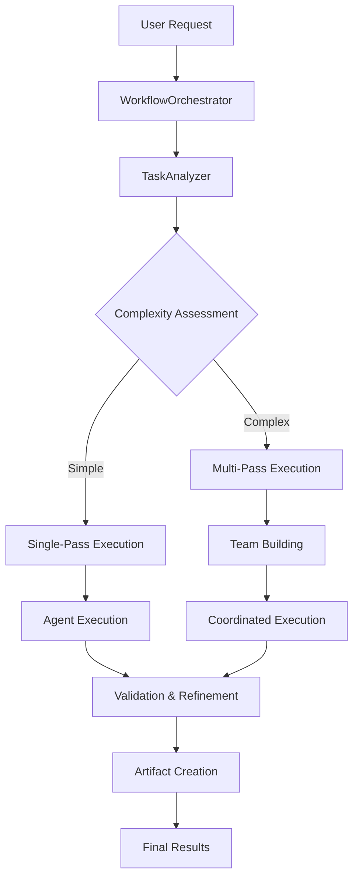
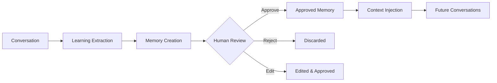

# DEVS - AI Agent Orchestration Platform

## Project Vision

Democratize AI agent delegation with a universally accessible, privacy-conscious, open-source solution that runs entirely in the browser.

## Core Concept

A browser-based AI orchestration platform that models real organizational dynamics, enabling users to delegate complex tasks to teams of AI agents that work together using proven business methodologies.

---

## Key Features

### 1. Browser-Native Architecture

- **No server dependencies** - Everything runs locally in the user's browser
- **Web technologies only** - HTML, CSS, TypeScript, Service Workers, IndexedDB, WebAssembly
- **Privacy-first** - All data stays on the user's device
- **Offline capable** - Works without internet connection after initial load
- **Low-spec hardware support** - Works on devices with 2GB RAM minimum
- **Accessibility-focused** - Multi-language support, keyboard navigation, screen reader compatibility

### 2. AI Studio Features

- Pre-built agent roles (CEO, Analyst, Developer, QA, etc.)
- Custom agent personality and capability configuration
- Real-time visualization of agent interactions and decisions

### 3. LLM Provider Independence

- Support for multiple LLM providers:
  - OpenAI, Anthropic, Google Gemini, Mistral, Ollama, Custom/Local endpoints
- Secure token storage using Web Crypto API
- Provider abstraction layer for seamless switching
- Usage tracking and cost estimation

### 4. Hyper Meta-Prompting System

- Multi-layered prompt generation:
  - Base personality layer
  - Role specialization layer
  - Task context layer
  - Dynamic adaptation layer
- Prompt inheritance and composition patterns
- Context-aware prompt compilation engine

### 5. Intelligent Multi-Agent Orchestration

The DEVS orchestration system implements autonomous multi-agent task coordination with intelligent analysis, team building, execution, and validation.

#### Architecture Overview



#### Core Orchestration Components

**WorkflowOrchestrator** ([src/lib/orchestrator.ts](src/lib/orchestrator.ts))

- Central coordination hub with deduplication prevention
- Strategy selection: single-pass vs multi-pass execution
- Comprehensive error handling and recovery
- Agent recruitment and team building

**TaskAnalyzer** ([src/lib/task-analyzer.ts](src/lib/task-analyzer.ts))

- LLM-powered prompt analysis
- Requirement extraction (functional/non-functional/constraints)
- Complexity assessment and skill identification
- Intelligent task breakdown with domain-specific patterns:
  - Creative Writing: Research → Character Development → Writing
  - Development: Analysis & Design → Implementation
  - Generic: Planning & Analysis → Execution & Delivery

**Agent Management** ([src/stores/agentStore.ts](src/stores/agentStore.ts))

- Agent lifecycle: Discovery → Recruitment → Caching → Execution
- Built-in agents from JSON + custom agents from IndexedDB
- Dynamic agent creation via agent-recruiter
- Skill matching and role assignment

#### Execution Strategies

**Single-Pass Strategy:**

- For simple tasks (complexity: 'simple')
- Find or create suitable agent
- Execute with enhanced context
- Validate and refine if needed

**Multi-Pass Strategy:**

- For complex tasks requiring multiple agents
- Break down into subtasks with dependencies
- Build specialized agent teams
- Coordinate parallel/sequential execution
- Handle validation failures with refinement workflows

#### Team Coordination Engine

```typescript
// Dependency resolution with parallel execution
coordinateTeamExecution(tasks, team) {
  while (executedTasks.size < tasks.length) {
    // Find tasks ready for execution (dependencies satisfied)
    const readyTasks = tasks.filter(task =>
      !executedTasks.has(task.id) &&
      task.dependencies.every(depId => executedTasks.has(depId))
    )

    // Execute in parallel batches (up to team size)
    const batch = readyTasks.slice(0, team.length)
    await Promise.all(batch.map((task, index) => {
      const agent = team[index % team.length]
      return executeTaskWithAgent(task, agent, task.description)
    }))
  }
}
```

**Coordination Features:**

- Dependency resolution with topological sorting
- Parallel batch execution up to team capacity
- Round-robin load balancing
- Circular dependency detection

#### Requirement Validation Engine

**RequirementValidator** ([src/lib/requirement-validator.ts](src/lib/requirement-validator.ts))

Validates three requirement types:

1. **Functional Requirements**: Feature implementation validation
   - Evidence: code snippets, configuration, test results

2. **Non-Functional Requirements**: Performance, scalability, usability
   - Evidence: performance reports, analysis documents

3. **Constraints**: Technology, time, resource limitations
   - Evidence: architectural decisions, implementation choices

**Validation Features:**

- Custom validator registration
- Evidence-based validation with artifact analysis
- Status tracking (satisfied/pending/failed)
- Automatic refinement task creation on failure

#### Error Handling & Retry Mechanisms

**Multi-Level Strategy:**

1. **Orchestration Level**
   - Duplicate prevention via prompt hashing
   - Graceful degradation with fallback agent creation
   - Transaction safety with rollback

2. **Validation Level**
   - Automatic refinement tasks for validation failures
   - Maintains original task context
   - Iterative improvement cycles

3. **Agent Level**
   - Fallback agent creation when recruitment fails
   - Skill-based agent matching
   - Dynamic team reconstruction

4. **Network Level**
   - LLM provider fallbacks
   - Timeout handling
   - Multi-strategy response parsing

#### Context Sharing & Collaboration

**ContextBroker** ([src/lib/context-broker.ts](src/lib/context-broker.ts))

Enables intelligent information sharing between agents:

```typescript
interface SharedContext {
  type: 'decision' | 'finding' | 'resource' | 'constraint'
  agentId: string
  content: string
  keywords: string[]
  expiresAt?: Date
}
```

- Publish/subscribe pattern for inter-agent communication
- Keyword-based context filtering
- Automatic expiration and cleanup

#### Default DEVS Agent

Sophisticated orchestrator agent with:

- Autonomous task analysis capabilities
- Multi-agent coordination instructions
- Requirement-driven execution approach
- Self-correcting workflow logic

#### Agent Memory System

**MemoryLearningService** ([src/lib/memory-learning-service.ts](src/lib/memory-learning-service.ts))

Enables agents to learn and remember information from conversations:



**Memory Categories:**

- **Facts**: Concrete information about the user or domain
- **Preferences**: User preferences and working styles
- **Behaviors**: Observed patterns and habits
- **Domain Knowledge**: Technical or specialized knowledge
- **Relationships**: Connections between concepts or people
- **Procedures**: Step-by-step processes
- **Corrections**: Rectifications of previous misunderstandings

**Confidence Levels:**

- **High**: Explicitly stated, reliable information
- **Medium**: Inferred with reasonable certainty
- **Low**: Tentative conclusions requiring validation

**Core Components:**

1. **AgentMemoryStore** ([src/stores/agentMemoryStore.ts](src/stores/agentMemoryStore.ts))
   - Memory CRUD operations with IndexedDB persistence
   - Learning event tracking
   - Memory document synthesis
   - Bulk operations and cleanup

2. **Memory Extraction**
   - LLM-powered extraction from conversations
   - Automatic categorization and confidence scoring
   - Keyword extraction for relevance matching
   - Robust JSON parsing with sanitization

3. **Human Review System**
   - Pending review queue for new memories
   - Approve/reject/edit workflow
   - Bulk operations support
   - Review notes and audit trail

4. **Context Injection**
   - Relevant memories injected into new conversations
   - Keyword-based relevance scoring
   - Confidence and recency boosting
   - Usage tracking for analytics

**Memory Data Schema:**

```typescript
interface AgentMemoryEntry {
  id: string
  agentId: string
  category: MemoryCategory
  title: string
  content: string
  confidence: MemoryConfidence
  source: 'conversation' | 'manual' | 'imported'
  sourceConversationId?: string
  keywords: string[]
  tags: string[]
  validationStatus: 'pending' | 'approved' | 'rejected' | 'auto_approved'
  reviewedAt?: Date
  reviewedBy?: string
  reviewNotes?: string
  usageCount: number
  lastUsedAt?: Date
  expiresAt?: Date
  learnedAt: Date
  version: number
  createdAt: Date
  updatedAt: Date
}
```

**Memory Synthesis:**

Generates a comprehensive markdown document summarizing all approved memories for an agent, organized by category with statistics.

### 6. Connectors - External Services Integration

Connectors enable DEVS to integrate with external services, importing content into the Knowledge Base. See [docs/CONNECTORS.md](docs/CONNECTORS.md) for full documentation.

**Connector Categories:**

| Category | Auth Method      | Examples                              | Status         |
| -------- | ---------------- | ------------------------------------- | -------------- |
| **Apps** | OAuth 2.0 PKCE   | Google Drive, Gmail, Calendar, Notion | ✅ Implemented |
| **APIs** | API Key / Bearer | Custom REST/GraphQL endpoints         | 🔜 Planned     |
| **MCPs** | MCP Protocol     | Local/Remote MCP servers              | 🔜 Planned     |

**Implemented App Connectors:**

- **Google Drive** - Import files and documents with delta sync
- **Gmail** - Import emails with label filtering
- **Google Calendar** - Import events as markdown documents
- **Notion** - Import pages and databases with block-to-markdown conversion

**Key Features:**

- OAuth 2.0 with PKCE for secure browser-based authentication
- Delta sync with cursor-based change tracking
- Content normalization to KnowledgeItem format
- Background sync via Service Worker
- Encrypted token storage using Web Crypto API

**Architecture:**

```
src/features/connectors/
├── oauth-gateway.ts        # OAuth 2.0 PKCE flow
├── provider-registry.ts    # Lazy-loaded provider management
├── sync-engine.ts          # Delta sync orchestration
├── normalizer.ts           # Content → KnowledgeItem
├── providers/apps/         # Provider implementations
├── components/             # UI components
└── hooks/                  # React hooks
```

### 7. Dynamic Team Formation (Future)

- Mimics human organizational structures and dynamics
- Agents with defined roles, responsibilities, and communication patterns
- Hierarchical and flat organization structures
- Inter-agent collaboration protocols

### 8. Web Grounding (Future)

- Agents can interact with web content
- Sandboxed iframe execution for safety
- Content extraction and parsing
- API integrations through browser-safe methods

### 8. P2P Collaboration (Future)

- WebRTC-based peer-to-peer connections
- Distributed agent orchestration across multiple users
- CRDT (Conflict-free Replicated Data Types) for shared state
- Privacy-preserving collaboration protocols

---

## User Experience

### Main Interface

- **Google-like simplicity** - Single prompt area as the primary interface
- **Agent selector dropdown** - "devs" as default orchestrator
- **Clean, focused design** - Complexity hidden until needed

### Default "devs" Orchestrator

Pre-configured development team with:

- Product Manager Agent - Requirements analysis
- Architect Agent - System design
- Developer Agents - Implementation
- QA Agent - Testing strategy
- DevOps Agent - Deployment planning

### Workflow Visualization

After prompt submission, users see:

- **Organization chart** - Active agents and their relationships
- **Workflow timeline** - Gantt chart of current progress
- **Agent chat panel** - Real-time agent discussions
- **Human controls** - Pause, intervene, approve actions

---

## Technical Architecture

The whole architecture is described in [ARCHITECTURE.md](ARCHITECTURE.md). @ARCHITECTURE.md

### Core Principles

- **KISS (Keep It Simple, Stupid):** Simple, straightforward solutions over complex ones
- **Composable:** Independent, interchangeable components
- **Performant:** Technologies known for speed and efficiency
- **Low-footprint:** Minimal resource consumption
- **Test-Driven Development (TDD):** Write failing tests first, then implement features

### Frontend Stack

- **Bundler:** [Vite](https://vitejs.dev/) with static mode
- **TypeScript** - For application logic
- **React components** - Using the [HeroUI](https://heroui.com) React components library
- **Service Workers** - For background processing and caching
- **Web Crypto API** - For secure token management
- **IndexedDB** - For local data storage
- **WebAssembly** - For performance-critical tasks
- **Serving:** Static site served using **Caddy**

### Testing Framework

- **Test Runner:** [Vitest](https://vitest.dev/) with jsdom environment
- **Testing Library:** [@testing-library/react](https://testing-library.com/docs/react-testing-library/intro/)
- **E2E Testing:** [Playwright](https://playwright.dev/) for end-to-end browser testing
- **Test Structure:** Unit tests for business logic, component tests for UI, integration tests for flows
- **TDD Approach:** Write failing tests first, implement features to pass tests, refactor while maintaining green tests
- **Test Organization:** Unit tests in `src/test/`, E2E tests in `tests/e2e/`
- **Coverage Tool:** `@vitest/coverage-v8` for code coverage reporting

#### Coverage Requirements

| Category                           | Target   | Priority    |
| ---------------------------------- | -------- | ----------- |
| `src/lib/**` (utilities)           | **60%+** | 🔴 Critical |
| `src/stores/**` (state management) | **60%+** | 🔴 Critical |
| `src/components/**`                | 30%+     | 🟡 Medium   |
| `src/pages/**`                     | 20%+     | 🟢 Low      |

#### TDD Mandate for New Features

**All new features and important enhancements in `src/lib/` and `src/stores/` MUST follow TDD:**

1. **Write tests first** - Create failing tests that describe the expected behavior
2. **Implement minimally** - Write just enough code to make tests pass
3. **Refactor safely** - Improve code quality while keeping tests green
4. **Verify coverage** - Run `npm run test:coverage` before committing

This ensures:

- LLMs can safely enhance features without causing regressions
- Critical business logic is always verified
- Refactoring is safe and confident

### Data Storage

Storage is handled entirely in the browser using IndexedDB, ensuring data privacy and offline capability.

### Data Schema

Data types are defined in [src/types/index.ts](src/types/index.ts).

```typescript
interface Agent {
  id: string
  name: string
  icon?: IconName
  role: string
  instructions: string
  temperature?: number
  tags?: string[]
  tools?: Tool[]
  createdAt: Date
  updatedAt?: Date
  version?: string
}

interface Task {
  id: string
  workflowId: string
  title: string
  description: string
  complexity: 'simple' | 'complex'
  status: 'pending' | 'in_progress' | 'completed' | 'failed'
  assignedAgentId?: string
  parentTaskId?: string // Enables task hierarchies
  dependencies: string[] // Task dependency management
  requirements: Requirement[]
  artifacts: string[]
  steps: TaskStep[]
  estimatedPasses: number
  actualPasses: number
  createdAt: Date
  updatedAt: Date
  completedAt?: Date
  dueDate?: Date
}

interface Requirement {
  id: string
  type: 'functional' | 'non-functional' | 'constraint'
  description: string
  priority: 'must' | 'should' | 'could' | 'wont'
  source: 'explicit' | 'implicit' | 'inferred'
  validationStatus?: 'satisfied' | 'pending' | 'failed'
  evidence?: string[]
}

interface Workflow {
  id: string
  strategy: string
  status: 'pending' | 'running' | 'completed'
  checkpoints: Checkpoint[]
}

interface Conversation {
  id: string
  agentId: string
  workflowId: string
  timestamp: Date
}

interface KnowledgeItem {
  id: string
  name: string
  type: 'file' | 'folder'
  fileType?: 'document' | 'image' | 'text'
  content?: string
  contentHash?: string // SHA-256 hash for deduplication
  mimeType?: string
  size?: number
  path: string
  parentId?: string
  lastModified: Date
  createdAt: Date
  tags?: string[]
  description?: string
  syncSource?: 'manual' | 'filesystem_api'
  fileSystemHandle?: string
  watchId?: string
  lastSyncCheck?: Date
}

interface Artifact {
  id: string
  taskId: string
  agentId: string
  type: string
  description: string
  content: string // Base64 encoded or file reference
  status: 'pending' | 'completed'
  validates?: string[] // Requirement IDs this artifact validates
  dueDate?: Date
  createdAt: Date
}

interface Tool {
  id: string
  name: string
  description: string
  type: 'file' | 'web' | 'api' | 'shell' | 'custom'
  config: Record<string, any>
}

interface Checkpoint {
  id: string
  name: string
  status: 'pending' | 'completed'
  timestamp: Date
}
```

### State Management Architecture

**Zustand Stores with IndexedDB Persistence:**

1. **TaskStore** ([src/stores/taskStore.ts](src/stores/taskStore.ts))
   - Task lifecycle management
   - Requirement validation integration
   - Step tracking and completion

2. **AgentStore** ([src/stores/agentStore.ts](src/stores/agentStore.ts))
   - Agent discovery and caching
   - Custom agent CRUD operations
   - Team building support

3. **ArtifactStore** ([src/stores/artifactStore.ts](src/stores/artifactStore.ts))
   - Artifact lifecycle management
   - Requirement linking and dependency tracking
   - Versioning support

4. **ConversationStore** ([src/stores/conversationStore.ts](src/stores/conversationStore.ts))
   - Multi-agent conversation tracking
   - Message history management
   - Title generation

5. **ContextStore** ([src/stores/contextStore.ts](src/stores/contextStore.ts))
   - Context sharing between agents
   - Expiration and cleanup
   - Relevance filtering

6. **UserStore** ([src/stores/userStore.ts](src/stores/userStore.ts))
   - User preferences and settings
   - Drawer state persistence
   - Theme and language management

7. **AgentMemoryStore** ([src/stores/agentMemoryStore.ts](src/stores/agentMemoryStore.ts))
   - Agent memory CRUD operations
   - Learning event management
   - Human review workflow
   - Memory retrieval with relevance scoring
   - Memory synthesis documents

**Store Patterns:**

- Database initialization checks
- Optimistic updates with rollback
- Error handling with toast notifications
- Cache invalidation strategies

### Knowledge Base System

Sophisticated knowledge management system for personal knowledge base maintenance:

#### File Management Features

- **Drag & Drop Upload** - Intuitive file uploading with visual feedback
- **Folder Watching** - Automatic synchronization with local directories using File System API
- **File Type Detection** - Automatic classification based on extension and content
- **Deduplication** - SHA-256 content hashing prevents duplicate storage
- **Real-time Sync** - Background synchronization every 30 seconds with change detection

#### Supported File Types

- **Text Files**: `.txt`, `.md`, `.js`, `.ts`, `.jsx`, `.tsx`, `.css`, `.html`, `.xml`, `.csv`, `.yaml`, `.yml`, `.log`
- **Image Files**: `.jpg`, `.jpeg`, `.png`, `.gif`, `.bmp`, `.webp`, `.svg`, `.ico`, `.tiff`, `.tif`
- **Document Files**: `.pdf`, `.doc`, `.docx`, `.xls`, `.xlsx`, `.ppt`, `.pptx`, `.rtf`, `.epub`

#### Automatic Synchronization

- **Change Detection** - Monitors file modifications, additions, deletions
- **Background Processing** - Non-blocking sync with progress feedback
- **Event System** - Real-time notifications (`sync_start`, `sync_complete`, `file_added`, `file_updated`, `file_deleted`, `sync_error`)
- **Error Recovery** - Graceful handling of permission errors
- **UI Feedback** - Toast notifications and visual indicators

#### Data Privacy & Security

- **Browser-only Storage** - All files stored locally in IndexedDB
- **No Server Upload** - Files never leave the user's device
- **Permission-based Access** - Uses File System API permissions
- **Content Hashing** - SHA-256 hashing for integrity and deduplication

### Security Features

- Token encryption using SubtleCrypto API
- No data ever leaves the browser
- Sandboxed execution environments
- Auto-lock after 15 minutes of inactivity
- Optional biometric authentication

### Performance Optimizations

- Service Workers for background processing
- WebAssembly for compute-intensive operations
- Lazy loading of agent components
- Cursor-based pagination for large datasets
- Multi-layer caching for agents, contexts, and artifacts
- Batch database operations
- Automatic cleanup of expired contexts

---

## Implementation Roadmap

### Phase 1: Core MVP

- Basic prompt interface with IndexedDB storage
- LLM independence functionality for major providers
- "devs" orchestrator with 3-5 core agents
- Custom agent builder
- Simple PDCA orchestration strategy
- Real-time workflow visualization

### Phase 2: Advanced Features

- Additional orchestration strategies (DMAIC, A3, 8D)
- Web grounding capabilities
- Advanced human-in-the-loop controls
- Performance analytics
- Dynamic team formation

### Phase 3: Ecosystem

- P2P collaboration features
- Marketplace for agents and strategies
- Plugin system for community contributions
- Multi-language support

---

## Design Principles

1. **Accessibility First** - Anyone should be able to use it, regardless of technical expertise
2. **Privacy by Design** - User data never leaves their control
3. **Progressive Disclosure** - Simple by default, powerful when needed
4. **Real-time Transparency** - Users can always see what agents are doing
5. **Fail Gracefully** - Clear error messages and recovery options

---

## Use Cases

- **Students** - Research assistance, study planning, assignment help
- **Small Businesses** - Operations management without large teams
- **Developers** - Rapid prototyping and code generation
- **Researchers** - Literature review, data analysis, hypothesis testing
- **Creative Professionals** - Brainstorming, content creation, project planning

---

## Development

### Running Tests

```bash
# Run all unit tests once
npm run test:run

# Run tests in watch mode (recommended during development)
npm run test:watch

# Run tests with coverage report
npm run test:coverage

# Run E2E tests
npm run test:e2e

# Run E2E tests with UI (interactive debugging)
npm run test:e2e:ui
```

### TDD Workflow (Mandatory for lib/ and stores/)

When adding or modifying code in `src/lib/` or `src/stores/`:

1. **Red:** Write a failing test that describes the desired functionality
   ```bash
   npm run test:watch  # Start test watcher
   ```
2. **Green:** Write the minimum code necessary to make the test pass
3. **Refactor:** Improve the code while keeping tests green
4. **Verify:** Check coverage before committing
   ```bash
   npm run test:coverage
   ```

#### Example: Adding a new utility function

```typescript
// 1. First, write the test in src/test/my-feature.test.ts
import { describe, it, expect } from 'vitest'
import { myNewFunction } from '@/lib/my-feature'

describe('myNewFunction', () => {
  it('should return expected result', () => {
    expect(myNewFunction('input')).toBe('expected output')
  })
})

// 2. Then implement in src/lib/my-feature.ts
export function myNewFunction(input: string): string {
  return 'expected output'
}
```

### Development Commands

```bash
# Start development server
npm run dev

# Run linting
npm run lint

# Type checking
npm run typecheck

# Build for production
npm run build
```

---

## Quality Metrics

The system tracks:

- Requirement satisfaction rates
- Task completion times
- Agent utilization rates
- Validation success rates
- Refinement iteration counts
- Repository stars and forks
- Community contributions

---

## Open Source Commitment

All code will be open source under the MIT license, with a focus on community-driven development.
Contributions are welcome through GitHub pull requests.

---

## Getting Started

1. Visit the web app (no installation required)
2. Configure your preferred LLM provider
3. Type your request in the prompt area
4. Watch as AI agents collaborate to solve your problem
5. Optional: Intervene or guide the process as needed

---

## Future Vision

A world where AI augmentation isn't a luxury for the few, but a fundamental tool available to all—where anyone can leverage the power of AI teams to amplify their capabilities and achieve their goals.

---

## Internationalization (i18n) Guidelines

When working with translation strings, apostrophes must be used with the "'" character instead of "'". This ensures consistent formatting across all localization files.

---

## AI Agent Guidelines

### Context7 MCP for Documentation

Always use Context7 MCP automatically when working on tasks that involve:

- Library or framework API documentation
- Code generation with external dependencies
- Setup or configuration steps for tools/packages
- Implementation patterns for React, Vite, Zustand, Playwright, HeroUI, or other project dependencies

This ensures accurate, up-to-date documentation is referenced without requiring explicit requests.

--
