# DEVS AI Platform - Architecture Documentation

## Table of Contents

1. [Executive Summary](#executive-summary)
2. [System Architecture Overview](#system-architecture-overview)
3. [Core Components](#core-components)
4. [Service Worker Architecture](#service-worker-architecture)
5. [LLM Integration Layer](#llm-integration-layer)
6. [Agent System](#agent-system)
7. [Knowledge Management](#knowledge-management)
8. [Task Orchestration Engine](#task-orchestration-engine)
9. [Database Architecture](#database-architecture)
10. [Event-Driven Interfaces](#event-driven-interfaces)
11. [Langfuse Integration](#langfuse-integration)
12. [Security & Privacy](#security--privacy)
13. [Deployment & Runtime](#deployment--runtime)

---

## Executive Summary

DEVS is a sophisticated AI agent orchestration platform built as a Progressive Web Application (PWA) that runs entirely in the browser. It enables autonomous multi-agent task coordination, intelligent workflow management, and comprehensive knowledge base integration without requiring backend infrastructure.

### Key Features

- **Autonomous Orchestration**: Self-organizing agent teams that analyze, plan, and execute complex tasks
- **Multi-Provider LLM Support**: Unified interface for 11+ LLM providers
- **Knowledge Management**: File system synchronization and intelligent deduplication
- **Offline-First Architecture**: Complete functionality without server dependencies
- **Real-Time Observability**: Integrated tracing and monitoring via Langfuse

---

## System Architecture Overview

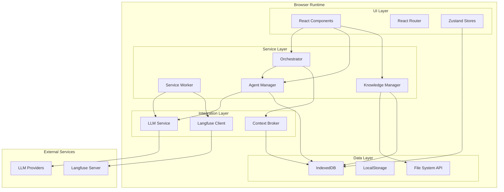

### Architectural Principles

1. **Client-Side Autonomy**: All processing happens in the browser
2. **Event-Driven Communication**: Loosely coupled components via events
3. **Progressive Enhancement**: Graceful degradation of features
4. **Privacy by Design**: User data never leaves the browser unless explicitly configured

---

## Core Components

### Component Architecture

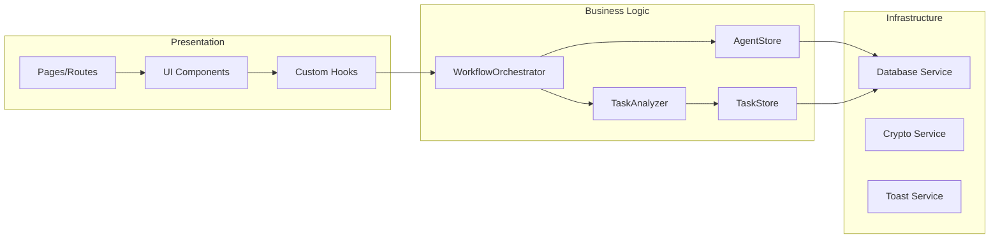

### Key Services

| Service              | Responsibility                | Location                      |
| -------------------- | ----------------------------- | ----------------------------- |
| WorkflowOrchestrator | Multi-agent coordination      | `src/lib/orchestrator.ts`     |
| TaskAnalyzer         | Task decomposition & analysis | `src/lib/task-analyzer.ts`    |
| AgentStore           | Agent lifecycle management    | `src/stores/agentStore.ts`    |
| TaskStore            | Task state management         | `src/stores/taskStore.ts`     |
| ArtifactManager      | Deliverable management        | `src/lib/artifact-manager.ts` |
| ContextBroker        | Inter-agent communication     | `src/lib/context-broker.ts`   |

---

## Service Worker Architecture

The service worker (`public/sw.js`) acts as a network proxy and background processing engine.

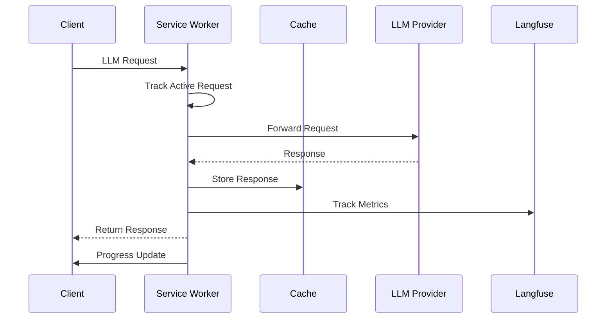

### Service Worker Capabilities

1. **Request Interception**
   - LLM API call proxying
   - Request/response caching
   - Offline fallback handling

2. **Progress Tracking**
   - Active request monitoring
   - Response time metrics
   - Success/failure rates

3. **Telemetry Collection**
   - Automatic Langfuse integration
   - Performance metrics
   - Usage analytics

### Implementation Details

```javascript
// Service Worker Message Flow
self.addEventListener('message', async (event) => {
  if (event.data.type === 'LLM_REQUEST') {
    // Track request
    activeRequests.set(requestId, requestData)

    // Execute request
    const response = await fetch(endpoint, options)

    // Track with Langfuse
    await trackLLMRequest(requestData, response, duration)

    // Update metrics
    updateAverageResponseTime(responseTime)
    broadcastProgressUpdate()
  }
})
```

---

## LLM Integration Layer

### Provider Architecture

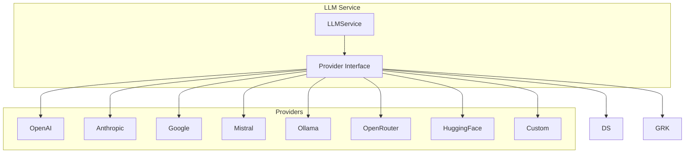

### Provider Interface

```typescript
interface LLMProviderInterface {
  chat(
    messages: LLMMessage[],
    config?: Partial<LLMConfig>,
  ): Promise<LLMResponse>
  streamChat(
    messages: LLMMessage[],
    config?: Partial<LLMConfig>,
  ): AsyncIterableIterator<string>
  validateApiKey(apiKey: string): Promise<boolean>
  getAvailableModels?(config?: Partial<LLMConfig>): Promise<string[]>
}
```

### Message Attachments

The system supports multimodal inputs via attachments:

```typescript
interface LLMMessageAttachment {
  type: 'image' | 'document' | 'text'
  name: string
  data: string // base64 encoded
  mimeType: string
}
```

---

## Agent System

### Agent Architecture

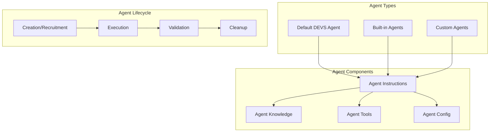

### Default DEVS Agent

The orchestrator agent with autonomous coordination capabilities:

```typescript
const defaultDevsTeam: Agent = {
  id: 'devs',
  name: 'DEVS',
  role: 'Autonomous Task Orchestrator and Multi-Agent Team Coordinator',
  instructions: `
    Core Capabilities:
    - Autonomous Task Analysis
    - Intelligent Agent Management
    - Requirement-Driven Execution
    - Self-Correcting Workflows
    - Context-Aware Coordination
  `,
  tags: ['orchestrator', 'autonomous', 'multi-agent', 'coordination'],
}
```

### Agent Recruitment

Dynamic agent creation via the agent-recruiter:

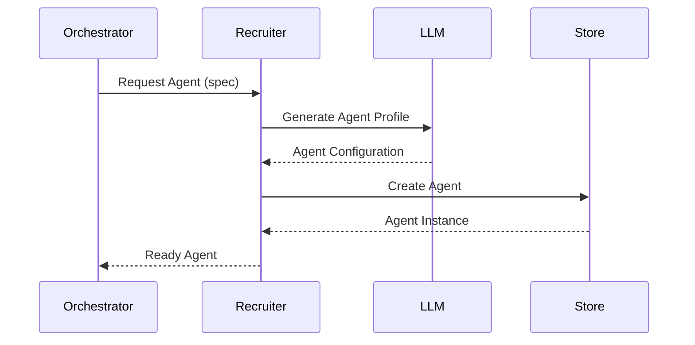

### Custom Agent Management

```typescript
// Agent CRUD Operations
async function createAgent(data: AgentData): Promise<Agent>
async function updateAgent(id: string, updates: Partial<Agent>): Promise<Agent>
async function deleteAgent(id: string): Promise<void>
async function loadCustomAgents(): Promise<Agent[]>
```

---

## Knowledge Management

### Knowledge System Architecture

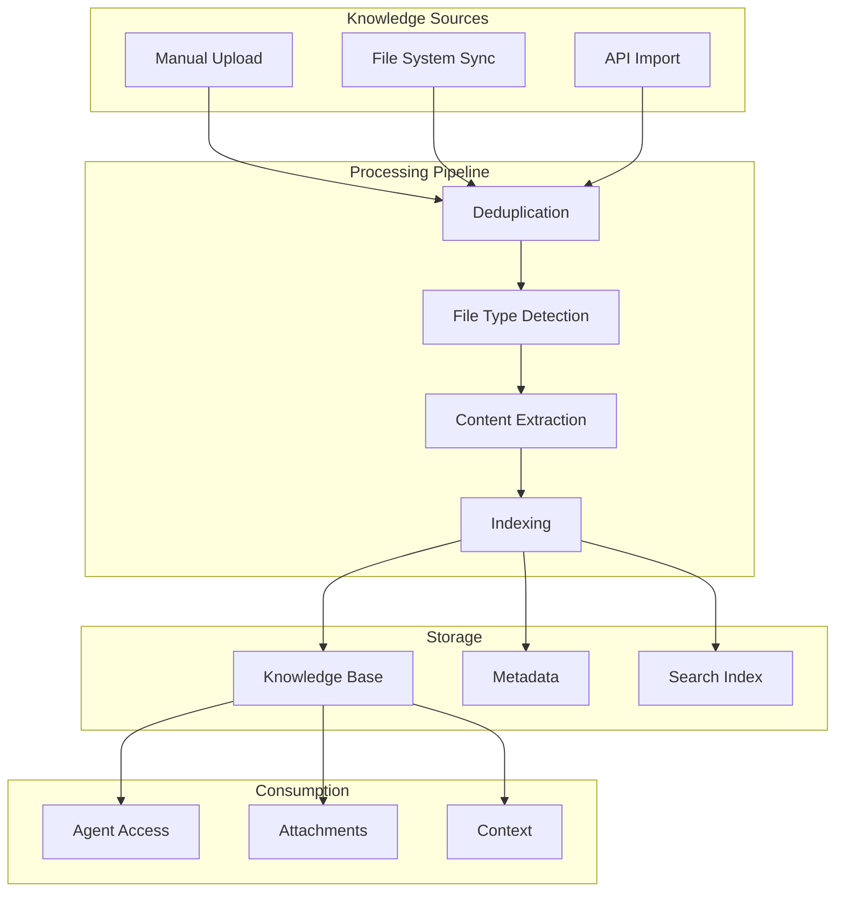

### File System Synchronization

```typescript
class KnowledgeSyncService {
  // Folder watching
  async registerFolderWatch(directoryHandle: FileSystemDirectoryHandle): Promise<string>
  async unregisterFolderWatch(watchId: string): Promise<void>

  // Synchronization
  private async syncFolder(watcher: FolderWatcher): Promise<void>
  private async processDirectoryRecursive(...): Promise<void>

  // Deduplication
  async generateContentHash(content: string): Promise<string>
  async isDuplicate(contentHash: string): Promise<KnowledgeItem | null>

  // File processing
  private detectFileType(file: File): 'document' | 'image' | 'text'
  private async readFileContent(file: File): Promise<string>
}
```

### Knowledge Item Structure

```typescript
interface KnowledgeItem {
  id: string
  name: string
  type: 'file' | 'folder'
  fileType?: 'document' | 'image' | 'text'
  content?: string
  contentHash?: string
  mimeType?: string
  size?: number
  path: string
  watchId?: string
  syncSource?: 'manual' | 'filesystem_api'
  lastModified: Date
  createdAt: Date
}
```

---

## Task Orchestration Engine

### Orchestration Flow

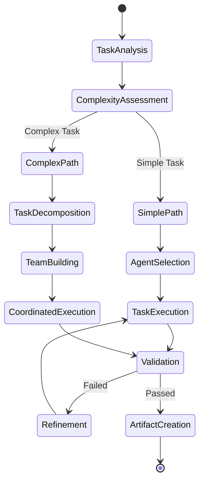

### Task Analysis Engine

```typescript
class TaskAnalyzer {
  static async analyzePrompt(prompt: string): Promise<TaskAnalysisResult> {
    // Returns:
    // - Requirements (functional/non-functional/constraints)
    // - Complexity assessment
    // - Required skills
    // - Suggested agents
    // - Duration estimates
  }

  static async breakdownTask(
    prompt: string,
    analysis: TaskAnalysisResult,
    workflowId: string,
  ): Promise<TaskBreakdown> {
    // Returns hierarchical task structure with dependencies
  }
}
```

### Requirement Validation

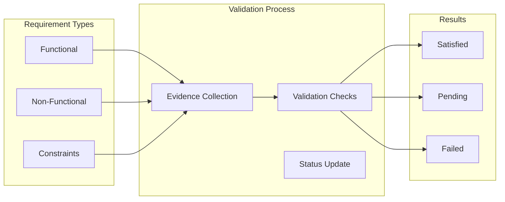

### Team Coordination

```typescript
private static async coordinateTeamExecution(
  tasks: Task[],
  team: Agent[]
): Promise<ExecutionResult[]> {
  // Dependency resolution
  // Parallel batch execution
  // Load balancing
  // Deadlock prevention
}
```

---

## Database Architecture

### IndexedDB Schema

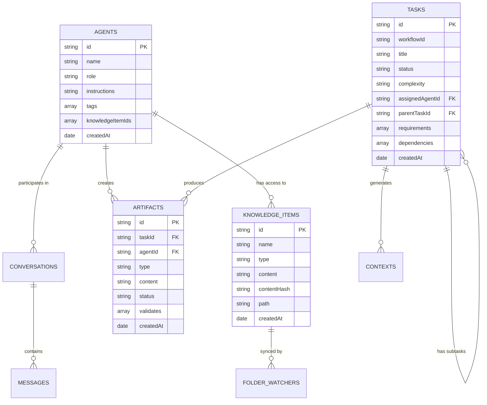

### Store Configuration

```typescript
const DB_STORES = [
  'agents', // Agent definitions
  'conversations', // Chat histories
  'knowledgeItems', // Knowledge base
  'folderWatchers', // Sync configurations
  'credentials', // Encrypted API keys
  'artifacts', // Task deliverables
  'tasks', // Task management
  'contexts', // Shared contexts
  'langfuse_config', // Observability config
]
```

### Database Operations

```typescript
class Database {
  async init(): Promise<void>
  async add<T>(storeName: T, data: DBStores[T]): Promise<string>
  async get<T>(storeName: T, id: string): Promise<DBStores[T]>
  async update<T>(storeName: T, data: DBStores[T]): Promise<void>
  async delete<T>(storeName: T, id: string): Promise<void>
  async query<T>(
    storeName: T,
    index: string,
    value: any,
  ): Promise<DBStores[T][]>
}
```

---

## Event-Driven Interfaces

### Event Architecture

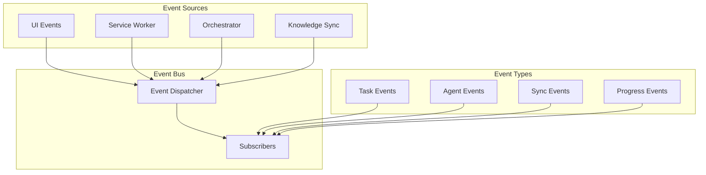

### Key Event Interfaces

#### Context Broker Events

```typescript
interface ContextSubscription {
  agentId: string
  contextTypes?: ContextType[]
  keywords?: string[]
  callback: (context: SharedContext) => void
}
```

#### Knowledge Sync Events

```typescript
interface SyncEvent {
  type:
    | 'sync_start'
    | 'sync_complete'
    | 'file_added'
    | 'file_updated'
    | 'file_deleted'
    | 'sync_error'
  watcherId: string
  watcherPath: string
  fileName?: string
  fileCount?: number
  error?: string
  timestamp: Date
}
```

#### Progress Events

```typescript
interface LLMProgressUpdate {
  type: 'LLM_PROGRESS_UPDATE'
  stats: {
    activeRequests: number
    totalRequests: number
    completedRequests: number
    averageResponseTime: number
  }
}
```

### Event Subscription Patterns

```typescript
// Knowledge sync subscription
const unsubscribe = knowledgeSync.onSyncEvent((event: SyncEvent) => {
  console.log('Sync event:', event)
})

// Context subscription
await ContextBroker.subscribeToContext({
  agentId: 'agent-123',
  contextTypes: ['decision', 'finding'],
  callback: (context) => processContext(context),
})

// Service Worker messages
navigator.serviceWorker.addEventListener('message', (event) => {
  if (event.data.type === 'LLM_PROGRESS_UPDATE') {
    updateProgressUI(event.data.stats)
  }
})
```

---

## Langfuse Integration

### Observability Architecture

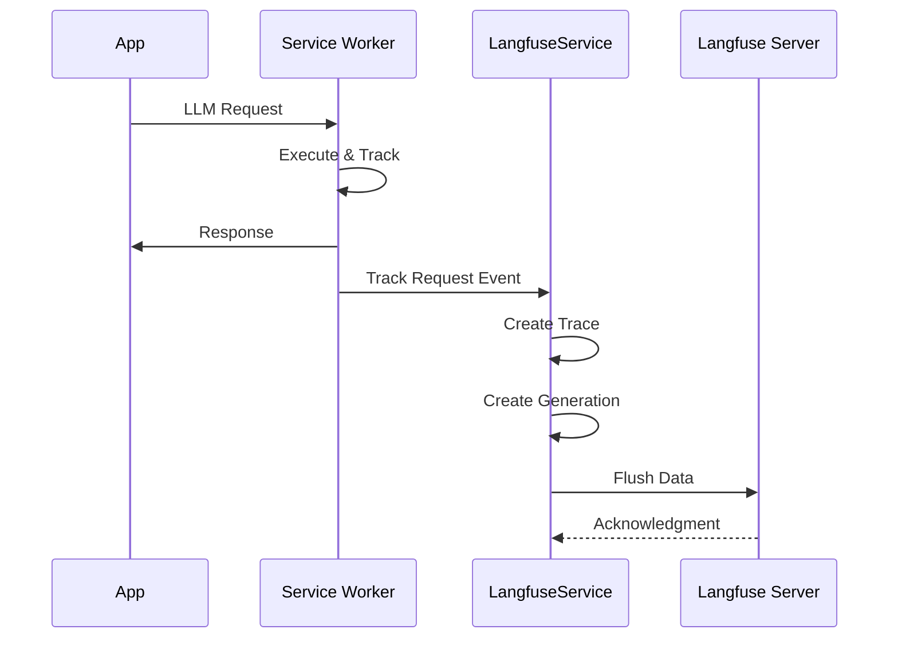

### Configuration Flow

```typescript
class LangfuseService {
  static async initializeClient() {
    // Load config from IndexedDB
    const config = await db.get('langfuse_config')

    // Decrypt credentials
    const secretKey = await SecureStorage.decryptCredential(
      config.encryptedSecretKey,
      iv,
      salt,
    )

    // Initialize client
    this.client = new Langfuse({
      publicKey: config.publicKey,
      secretKey: secretKey,
      baseUrl: config.host,
    })
  }
}
```

### Tracking Implementation

```typescript
static async trackRequest(data: any, ctx: RequestContext) {
  const trace = this.client.trace({
    name: `${data.provider} - ${data.model}`,
    sessionId: ctx.taskId,
    userId: 'devs-user',
    metadata: {
      provider: data.provider,
      conversationId: ctx.conversationId,
      agentId: ctx.agentId
    }
  })

  const generation = trace.generation({
    model: data.model,
    usage: {
      promptTokens: data.usage.prompt_tokens,
      completionTokens: data.usage.completion_tokens
    }
  })

  await this.client.flushAsync()
}
```

---

## Security & Privacy

### Security Architecture

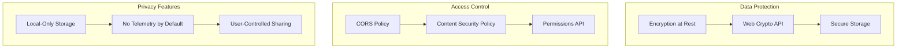

### Credential Encryption

```typescript
class SecureStorage {
  static async encryptCredential(credential: string): Promise<{
    encrypted: string
    iv: string
    salt: string
  }>

  static async decryptCredential(
    encrypted: string,
    iv: string,
    salt: string,
  ): Promise<string>
}
```

### Privacy Principles

1. **Data Locality**: All user data stays in browser
2. **Opt-in Telemetry**: Langfuse disabled by default
3. **Encrypted Storage**: Sensitive data encrypted with Web Crypto API
4. **No Backend**: No server-side data collection
5. **User Control**: Full data export/import capabilities

---

## Deployment & Runtime

### Progressive Web App Configuration

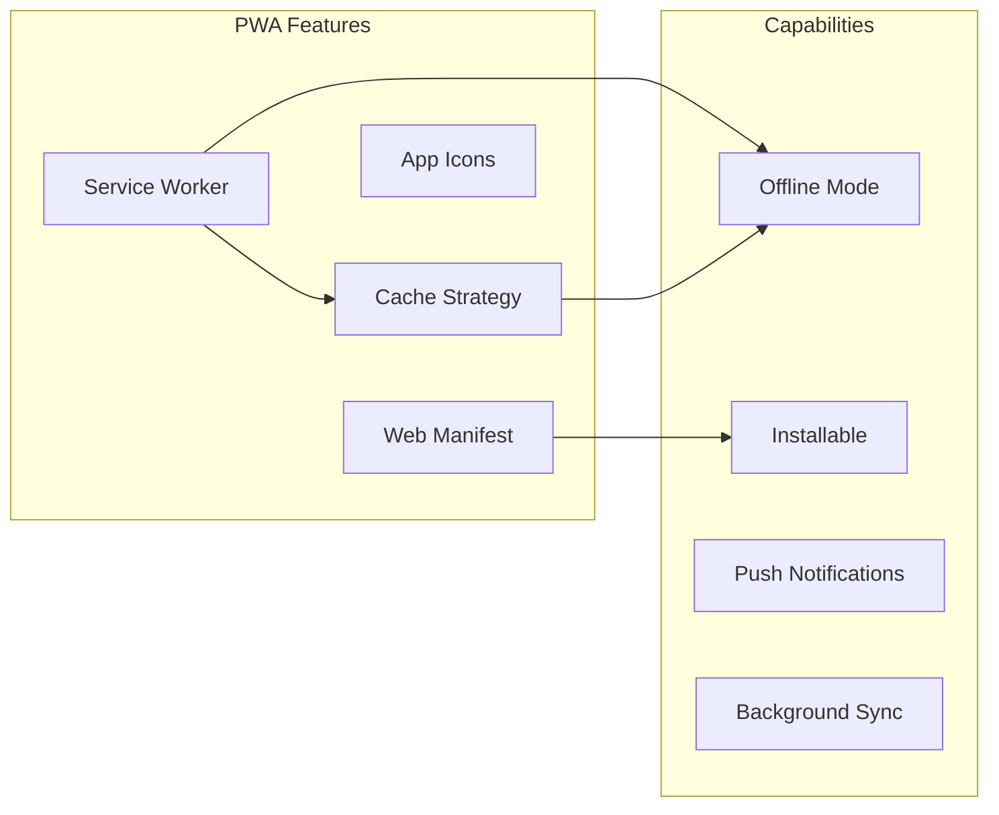

### Build & Deployment

```json
{
  "scripts": {
    "dev": "vite",
    "build": "tsc && vite build",
    "preview": "vite preview"
  }
}
```

### Runtime Requirements

| Requirement | Minimum    | Recommended        |
| ----------- | ---------- | ------------------ |
| Browser     | Chrome 90+ | Latest Chrome/Edge |
| Memory      | 2GB RAM    | 4GB+ RAM           |
| Storage     | 100MB      | 1GB+               |
| Network     | 1 Mbps     | 10+ Mbps           |

### Performance Optimizations

1. **Code Splitting**: Lazy loading of routes and components
2. **Caching Strategy**: Service Worker cache-first for assets
3. **IndexedDB Optimization**: Indexed queries and batch operations
4. **Memory Management**: Automatic cleanup of expired contexts
5. **Parallel Processing**: Web Workers for heavy computations

### Monitoring & Observability

```typescript
// Performance monitoring
const performanceObserver = new PerformanceObserver((list) => {
  for (const entry of list.getEntries()) {
    // Track LCP, FID, CLS
    analytics.track('performance', entry)
  }
})

// Error tracking
window.addEventListener('error', (event) => {
  console.error('Global error:', event.error)
  // Send to monitoring service if configured
})
```

---

## Conclusion

The DEVS AI Platform represents a sophisticated, privacy-first approach to AI agent orchestration. By leveraging modern browser capabilities and a robust client-side architecture, it delivers enterprise-grade features without traditional backend infrastructure. The system's modular design, comprehensive state management, and intelligent automation capabilities make it suitable for complex, multi-step AI workflows while maintaining complete user control over data and processing.

### Key Architectural Strengths

- **Autonomous Operation**: Self-organizing agent teams with minimal user intervention
- **Scalable Design**: Efficient resource management and parallel execution
- **Privacy-First**: All data processing happens locally
- **Extensible Framework**: Plugin architecture for agents and providers
- **Observable System**: Built-in telemetry and monitoring capabilities

### Future Considerations

- WebAssembly integration for performance-critical operations
- P2P collaboration via WebRTC
- Federated learning capabilities
- Extended tool ecosystem for agents
- Advanced workflow templates and patterns

---

_This architecture document reflects the current state of the DEVS platform. For implementation details and updates, refer to the source code and component documentation._
