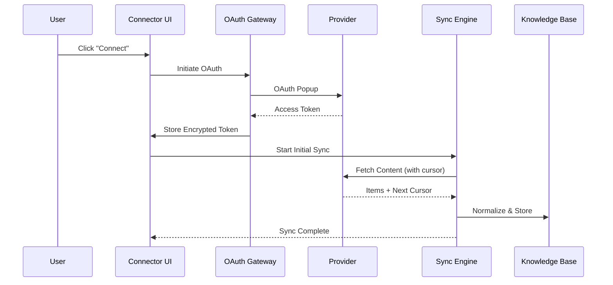

# Connectors - External Services Integration

> **Status**: Planning
> **Category**: Feature
> **Location**: `src/features/connectors/`

## Overview

Connectors enable DEVS to integrate with external services, importing content into the Knowledge Base and providing agents with access to external data sources. The architecture supports three connector categories, with **App Connectors** (OAuth-based services) as the initial implementation.

---

## Connector Categories

| Category | Auth Method      | Examples                              | Phase |
| -------- | ---------------- | ------------------------------------- | ----- |
| **Apps** | OAuth 2.0 PKCE   | Google Drive, Gmail, Calendar, Notion | 1     |
| **APIs** | API Key / Bearer | Custom REST/GraphQL endpoints         | 2     |
| **MCPs** | MCP Protocol     | Local/Remote MCP servers              | 3     |

---

## Architecture

```
┌─────────────────────────────────────────────────────────────────────┐
│                       Connector Categories                          │
├─────────────────────┬─────────────────────┬─────────────────────────┤
│    📱 Apps          │    🔌 APIs          │    🤖 MCPs              │
│    (OAuth 2.0)      │    (REST/GraphQL)   │    (MCP Protocol)       │
├─────────────────────┼─────────────────────┼─────────────────────────┤
│ • Google Drive      │ • Custom endpoints  │ • Local MCP servers     │
│ • Gmail             │ • Webhooks          │ • Remote MCP servers    │
│ • Google Calendar   │ • API key auth      │ • Tool discovery        │
│ • Notion            │ • Bearer tokens     │ • Resource providers    │
│ • Dropbox           │                     │                         │
│ • GitHub            │                     │                         │
└─────────────────────┴─────────────────────┴─────────────────────────┘
                              │
                              ▼
              ┌───────────────────────────────┐
              │   Unified Connector Manager   │
              │   - Category-aware routing    │
              │   - Shared sync engine        │
              │   - Common UI patterns        │
              └───────────────────────────────┘
                              │
                              ▼
              ┌───────────────────────────────┐
              │        Knowledge Base         │
              │   - Normalized content        │
              │   - Source tracking           │
              │   - Delta sync state          │
              └───────────────────────────────┘
```

### Data Flow



---

## Folder Structure

```
src/features/connectors/
├── index.ts                    # Public exports
├── types.ts                    # Connector-specific types
├── connector-provider.ts       # Base interfaces
├── oauth-gateway.ts            # OAuth 2.0 PKCE flow
├── provider-registry.ts        # Lazy loading registry
├── sync-engine.ts              # Unified sync orchestration
├── normalizer.ts               # → KnowledgeItem transforms
│
├── providers/
│   ├── apps/                   # Phase 1: App connectors
│   │   ├── index.ts
│   │   ├── google-drive.ts
│   │   ├── gmail.ts
│   │   ├── google-calendar.ts
│   │   └── notion.ts
│   │
│   ├── api/                    # Phase 2: Custom APIs
│   │   ├── index.ts
│   │   └── custom-api.ts
│   │
│   └── mcp/                    # Phase 3: MCP servers
│       ├── index.ts
│       └── custom-mcp.ts
│
├── components/                 # UI components
│   ├── ConnectorWizard/
│   │   ├── index.tsx
│   │   ├── AppWizard.tsx
│   │   ├── ProviderGrid.tsx
│   │   └── FolderPicker.tsx
│   ├── ConnectorCard.tsx
│   ├── ConnectorSyncStatus.tsx
│   └── ConnectorIcon.tsx
│
├── hooks/                      # React hooks
│   ├── useConnector.ts
│   ├── useConnectorSync.ts
│   └── useOAuth.ts
│
└── i18n/                       # Translations
    ├── en.ts
    ├── fr.ts
    └── index.ts
```

---

## Type Definitions

### Connector Categories & Providers

```typescript
// Connector Categories
export type ConnectorCategory = 'app' | 'api' | 'mcp'

// App Connectors (OAuth-based)
export type AppConnectorProvider =
  | 'google-drive'
  | 'gmail'
  | 'google-calendar'
  | 'notion'
  | 'dropbox'
  | 'github'

// API Connectors (custom endpoints)
export type ApiConnectorProvider = 'custom-api'

// MCP Connectors (Model Context Protocol)
export type McpConnectorProvider = 'custom-mcp'

export type ConnectorProvider =
  | AppConnectorProvider
  | ApiConnectorProvider
  | McpConnectorProvider
```

### Connector Interface

```typescript
export interface Connector {
  id: string
  category: ConnectorCategory
  provider: ConnectorProvider
  name: string // User-defined display name

  // App connectors (OAuth)
  encryptedToken?: string
  encryptedRefreshToken?: string
  tokenExpiresAt?: Date
  scopes?: string[]
  accountId?: string // For linking Google services
  accountEmail?: string // Display purposes

  // API connectors (future)
  apiConfig?: {
    baseUrl: string
    authType: 'bearer' | 'api-key' | 'basic' | 'none'
    encryptedCredential?: string
    headers?: Record<string, string>
  }

  // MCP connectors (future)
  mcpConfig?: {
    serverUrl: string
    transport: 'stdio' | 'sse' | 'websocket'
    capabilities?: string[]
  }

  // Sync configuration
  syncEnabled: boolean
  syncFolders?: string[] // Selected folders/databases
  syncInterval?: number // Minutes between syncs

  // Status
  status: 'connected' | 'error' | 'expired' | 'syncing'
  errorMessage?: string
  lastSyncAt?: Date

  // Metadata
  createdAt: Date
  updatedAt: Date
}
```

### Sync State

```typescript
export interface ConnectorSyncState {
  id: string
  connectorId: string
  cursor: string | null // Provider-specific delta token
  lastSyncAt: Date
  itemsSynced: number
  syncType: 'full' | 'delta'
  status: 'idle' | 'syncing' | 'error'
  errorMessage?: string
}
```

### Provider Configuration

```typescript
export interface ConnectorProviderConfig {
  id: ConnectorProvider
  category: ConnectorCategory
  name: string
  icon: string
  color: string

  // OAuth config (for apps)
  oauth?: {
    authUrl: string
    tokenUrl: string
    scopes: string[]
    clientId: string
    pkceRequired: boolean
  }

  // Capabilities
  capabilities: ('read' | 'write' | 'search' | 'watch')[]
  supportedTypes: string[] // File extensions or content types
  maxFileSize: number // Bytes

  // Rate limits
  rateLimit?: {
    requests: number
    windowSeconds: number
  }
}
```

### KnowledgeItem Extension

```typescript
// Extend existing KnowledgeItem
export interface KnowledgeItem {
  // ... existing fields

  // Connector source tracking
  connectorId?: string // Source connector
  externalId?: string // ID in external system
  externalUrl?: string // Direct link to source
  syncedAt?: Date // Last sync timestamp
}
```

---

## Provider Interface

### Base Interface

```typescript
export interface ConnectorProviderInterface {
  readonly id: ConnectorProvider
  readonly config: ConnectorProviderConfig

  // Lifecycle
  initialize?(): Promise<void>
  dispose?(): Promise<void>

  // Content Operations
  list(connector: Connector, options?: ListOptions): Promise<ListResult>
  read(connector: Connector, externalId: string): Promise<ContentResult>
  search?(connector: Connector, query: string): Promise<SearchResult>

  // Delta Sync
  getChanges(
    connector: Connector,
    cursor: string | null,
  ): Promise<ChangesResult>

  // Normalization
  normalizeItem(rawItem: unknown): Partial<KnowledgeItem>
}
```

### App Provider Extension

```typescript
export interface AppConnectorProviderInterface
  extends ConnectorProviderInterface {
  // Authentication
  authenticate(): Promise<OAuthResult>
  refreshToken(connector: Connector): Promise<TokenRefreshResult>
  validateToken(token: string): Promise<boolean>
  revokeAccess(connector: Connector): Promise<void>

  // Account info
  getAccountInfo(token: string): Promise<AccountInfo>
}
```

### Result Types

```typescript
export interface ListOptions {
  path?: string
  cursor?: string
  pageSize?: number
  filter?: Record<string, unknown>
}

export interface ListResult {
  items: Partial<KnowledgeItem>[]
  nextCursor?: string
  hasMore: boolean
}

export interface ContentResult {
  content: string | ArrayBuffer
  mimeType: string
  metadata?: Record<string, unknown>
}

export interface ChangesResult {
  added: Partial<KnowledgeItem>[]
  modified: Partial<KnowledgeItem>[]
  deleted: string[] // External IDs
  newCursor: string
  hasMore: boolean
}

export interface OAuthResult {
  accessToken: string
  refreshToken?: string
  expiresIn?: number
  scope: string
  tokenType: string
}

export interface TokenRefreshResult {
  accessToken: string
  expiresIn?: number
}

export interface AccountInfo {
  id: string
  email?: string
  name?: string
  picture?: string
}
```

---

## OAuth Gateway

### PKCE Flow

```typescript
// src/features/connectors/oauth-gateway.ts

export class OAuthGateway {
  private static pendingAuth: Map<string, PendingAuth> = new Map()

  /**
   * Initiate OAuth flow with PKCE
   */
  static async authenticate(
    provider: AppConnectorProvider,
  ): Promise<OAuthResult> {
    const config = getProviderConfig(provider)
    if (!config.oauth) throw new Error('Provider does not support OAuth')

    // Generate PKCE challenge
    const codeVerifier = generateCodeVerifier()
    const codeChallenge = await generateCodeChallenge(codeVerifier)
    const state = generateState()

    // Build auth URL
    const authUrl = new URL(config.oauth.authUrl)
    authUrl.searchParams.set('client_id', config.oauth.clientId)
    authUrl.searchParams.set('redirect_uri', getRedirectUri())
    authUrl.searchParams.set('response_type', 'code')
    authUrl.searchParams.set('scope', config.oauth.scopes.join(' '))
    authUrl.searchParams.set('state', state)
    authUrl.searchParams.set('code_challenge', codeChallenge)
    authUrl.searchParams.set('code_challenge_method', 'S256')

    // Store pending auth
    this.pendingAuth.set(state, {
      provider,
      codeVerifier,
      timestamp: Date.now(),
    })

    // Open popup and wait for callback
    return this.openPopupAndWait(authUrl.toString(), state)
  }

  /**
   * Handle OAuth callback
   */
  static async handleCallback(
    code: string,
    state: string,
  ): Promise<OAuthResult> {
    const pending = this.pendingAuth.get(state)
    if (!pending) throw new Error('Invalid OAuth state')

    const config = getProviderConfig(pending.provider)

    // Exchange code for token
    const response = await fetch(config.oauth!.tokenUrl, {
      method: 'POST',
      headers: { 'Content-Type': 'application/x-www-form-urlencoded' },
      body: new URLSearchParams({
        client_id: config.oauth!.clientId,
        code,
        code_verifier: pending.codeVerifier,
        grant_type: 'authorization_code',
        redirect_uri: getRedirectUri(),
      }),
    })

    if (!response.ok) throw new Error('Token exchange failed')

    const data = await response.json()
    this.pendingAuth.delete(state)

    return {
      accessToken: data.access_token,
      refreshToken: data.refresh_token,
      expiresIn: data.expires_in,
      scope: data.scope,
      tokenType: data.token_type,
    }
  }
}
```

### Google Account Linking

Since Gmail, Drive, and Calendar all use Google OAuth, users can connect once and enable multiple services:

```typescript
// Combine scopes for single auth flow
const GOOGLE_SCOPES = {
  'google-drive': ['https://www.googleapis.com/auth/drive.readonly'],
  gmail: [
    'https://www.googleapis.com/auth/userinfo.email',
    'https://www.googleapis.com/auth/userinfo.profile',
    'https://www.googleapis.com/auth/gmail.readonly',
    'https://www.googleapis.com/auth/gmail.compose',
  ],
  'google-calendar': ['https://www.googleapis.com/auth/calendar.readonly'],
}

// When connecting a Google service, check for existing Google connector
async function connectGoogleService(provider: AppConnectorProvider) {
  const store = useConnectorStore.getState()
  const existingGoogle = store.connectors.find(
    (c) =>
      c.accountEmail &&
      ['google-drive', 'gmail', 'google-calendar'].includes(c.provider),
  )

  if (existingGoogle) {
    // Offer to reuse existing account or connect new
    // If reusing, request additional scopes incrementally
  }
}
```

---

## Sync Engine

### Delta Sync Strategy

```typescript
// src/features/connectors/sync-engine.ts

export class SyncEngine {
  private static syncQueue: Map<string, SyncJob> = new Map()

  /**
   * Perform delta sync for a connector
   */
  static async sync(connectorId: string): Promise<SyncResult> {
    const store = useConnectorStore.getState()
    const connector = store.connectors.find((c) => c.id === connectorId)
    if (!connector) throw new Error('Connector not found')

    // Get provider
    const provider = await ProviderRegistry.get(connector.provider)

    // Get current sync state
    const syncState = store.syncStates.get(connectorId)
    const cursor = syncState?.cursor ?? null

    // Update status
    store.updateConnector(connectorId, { status: 'syncing' })

    try {
      // Fetch changes
      const changes = await provider.getChanges(connector, cursor)

      // Process changes
      await this.processChanges(connector, changes)

      // Update sync state
      store.updateSyncState(connectorId, {
        cursor: changes.newCursor,
        lastSyncAt: new Date(),
        itemsSynced: changes.added.length + changes.modified.length,
        syncType: cursor ? 'delta' : 'full',
        status: 'idle',
      })

      // Continue if more changes
      if (changes.hasMore) {
        return this.sync(connectorId)
      }

      store.updateConnector(connectorId, {
        status: 'connected',
        lastSyncAt: new Date(),
      })

      return {
        success: true,
        itemsSynced: changes.added.length + changes.modified.length,
      }
    } catch (error) {
      store.updateConnector(connectorId, {
        status: 'error',
        errorMessage: error.message,
      })
      throw error
    }
  }

  /**
   * Process changes from provider
   */
  private static async processChanges(
    connector: Connector,
    changes: ChangesResult,
  ): Promise<void> {
    const knowledgeStore = useKnowledgeStore.getState()

    // Add new items
    for (const item of changes.added) {
      const normalized = {
        ...item,
        connectorId: connector.id,
        syncedAt: new Date(),
      }

      // Check for duplicates via content hash
      const existing = await knowledgeStore.findByContentHash(
        normalized.contentHash,
      )
      if (!existing) {
        await knowledgeStore.addItem(normalized as KnowledgeItem)
      }
    }

    // Update modified items
    for (const item of changes.modified) {
      await knowledgeStore.updateByExternalId(
        connector.id,
        item.externalId!,
        item,
      )
    }

    // Remove deleted items
    for (const externalId of changes.deleted) {
      await knowledgeStore.deleteByExternalId(connector.id, externalId)
    }
  }
}
```

### Background Sync (Service Worker)

```javascript
// public/sw.js additions

// Background Sync registration
self.addEventListener('sync', (event) => {
  if (event.tag.startsWith('connector-sync:')) {
    const connectorId = event.tag.replace('connector-sync:', '')
    event.waitUntil(performBackgroundSync(connectorId))
  }
})

// Periodic sync (where supported)
self.addEventListener('periodicsync', (event) => {
  if (event.tag === 'connector-sync-all') {
    event.waitUntil(syncAllConnectors())
  }
})

// Message handling
self.addEventListener('message', (event) => {
  switch (event.data.type) {
    case 'CONNECTOR_SYNC_REQUEST':
      event.waitUntil(performBackgroundSync(event.data.connectorId))
      break
  }
})

async function performBackgroundSync(connectorId) {
  // Post progress updates
  self.clients.matchAll().then((clients) => {
    clients.forEach((client) => {
      client.postMessage({ type: 'CONNECTOR_SYNC_START', connectorId })
    })
  })

  try {
    // Sync logic here...

    self.clients.matchAll().then((clients) => {
      clients.forEach((client) => {
        client.postMessage({ type: 'CONNECTOR_SYNC_COMPLETE', connectorId })
      })
    })
  } catch (error) {
    self.clients.matchAll().then((clients) => {
      clients.forEach((client) => {
        client.postMessage({
          type: 'CONNECTOR_SYNC_ERROR',
          connectorId,
          error: error.message,
        })
      })
    })
  }
}
```

---

## Provider Implementations

### Google Drive

```typescript
// src/features/connectors/providers/apps/google-drive.ts

export class GoogleDriveProvider implements AppConnectorProviderInterface {
  readonly id = 'google-drive' as const
  readonly config: ConnectorProviderConfig = {
    id: 'google-drive',
    category: 'app',
    name: 'Google Drive',
    icon: 'google-drive',
    color: '#4285F4',
    oauth: {
      authUrl: 'https://accounts.google.com/o/oauth2/v2/auth',
      tokenUrl: 'https://oauth2.googleapis.com/token',
      scopes: ['https://www.googleapis.com/auth/drive.readonly'],
      clientId: import.meta.env.VITE_GOOGLE_CLIENT_ID,
      pkceRequired: true,
    },
    capabilities: ['read', 'search'],
    supportedTypes: ['*'],
    maxFileSize: 10 * 1024 * 1024, // 10MB
    rateLimit: { requests: 1000, windowSeconds: 100 },
  }

  async getChanges(
    connector: Connector,
    cursor: string | null,
  ): Promise<ChangesResult> {
    const token = await this.getDecryptedToken(connector)

    if (!cursor) {
      // Initial sync - get start page token first
      const startToken = await this.getStartPageToken(token)
      return this.fetchChanges(token, startToken)
    }

    return this.fetchChanges(token, cursor)
  }

  private async fetchChanges(
    token: string,
    pageToken: string,
  ): Promise<ChangesResult> {
    const response = await fetch(
      `https://www.googleapis.com/drive/v3/changes?pageToken=${pageToken}&fields=*`,
      { headers: { Authorization: `Bearer ${token}` } },
    )

    const data = await response.json()

    return {
      added: data.changes
        .filter((c) => c.type === 'file' && !c.removed)
        .map((c) => this.normalizeItem(c.file)),
      modified: [], // Drive API includes modifications in changes
      deleted: data.changes.filter((c) => c.removed).map((c) => c.fileId),
      newCursor: data.newStartPageToken || data.nextPageToken,
      hasMore: !!data.nextPageToken,
    }
  }

  normalizeItem(file: GoogleDriveFile): Partial<KnowledgeItem> {
    return {
      externalId: file.id,
      name: file.name,
      type:
        file.mimeType === 'application/vnd.google-apps.folder'
          ? 'folder'
          : 'file',
      fileType: this.detectFileType(file.mimeType),
      mimeType: file.mimeType,
      size: parseInt(file.size || '0'),
      path: file.parents?.[0] || '/',
      lastModified: new Date(file.modifiedTime),
      externalUrl: file.webViewLink,
      contentHash: file.md5Checksum,
    }
  }
}
```

### Gmail

```typescript
// src/features/connectors/providers/apps/gmail.ts

export class GmailProvider implements AppConnectorProviderInterface {
  readonly id = 'gmail' as const
  readonly config: ConnectorProviderConfig = {
    id: 'gmail',
    category: 'app',
    name: 'Gmail',
    icon: 'gmail',
    color: '#EA4335',
    oauth: {
      authUrl: 'https://accounts.google.com/o/oauth2/v2/auth',
      tokenUrl: 'https://oauth2.googleapis.com/token',
      scopes: [
        'https://www.googleapis.com/auth/userinfo.email',
        'https://www.googleapis.com/auth/userinfo.profile',
        'https://www.googleapis.com/auth/gmail.readonly',
        'https://www.googleapis.com/auth/gmail.compose',
      ],
      clientId: import.meta.env.VITE_GOOGLE_CLIENT_ID,
      pkceRequired: true,
    },
    capabilities: ['read', 'search'],
    supportedTypes: ['email'],
    maxFileSize: 25 * 1024 * 1024, // 25MB
  }

  async getChanges(
    connector: Connector,
    cursor: string | null,
  ): Promise<ChangesResult> {
    const token = await this.getDecryptedToken(connector)

    // Gmail uses history API for delta sync
    if (cursor) {
      return this.fetchHistory(token, cursor)
    }

    // Initial sync - fetch recent messages
    return this.fetchInitialMessages(token)
  }

  normalizeItem(message: GmailMessage): Partial<KnowledgeItem> {
    const headers = message.payload?.headers || []
    const subject =
      headers.find((h) => h.name === 'Subject')?.value || 'No Subject'
    const from = headers.find((h) => h.name === 'From')?.value || ''
    const date = headers.find((h) => h.name === 'Date')?.value

    return {
      externalId: message.id,
      name: subject,
      type: 'file',
      fileType: 'document',
      mimeType: 'message/rfc822',
      content: this.extractBody(message),
      path: `/gmail/${message.labelIds?.[0] || 'inbox'}`,
      lastModified: date ? new Date(date) : new Date(),
      externalUrl: `https://mail.google.com/mail/u/0/#inbox/${message.id}`,
      tags: message.labelIds,
      description: `From: ${from}`,
    }
  }
}
```

### Google Calendar

```typescript
// src/features/connectors/providers/apps/google-calendar.ts

export class GoogleCalendarProvider implements AppConnectorProviderInterface {
  readonly id = 'google-calendar' as const
  readonly config: ConnectorProviderConfig = {
    id: 'google-calendar',
    category: 'app',
    name: 'Google Calendar',
    icon: 'google-calendar',
    color: '#4285F4',
    oauth: {
      authUrl: 'https://accounts.google.com/o/oauth2/v2/auth',
      tokenUrl: 'https://oauth2.googleapis.com/token',
      scopes: ['https://www.googleapis.com/auth/calendar.readonly'],
      clientId: import.meta.env.VITE_GOOGLE_CLIENT_ID,
      pkceRequired: true,
    },
    capabilities: ['read', 'search'],
    supportedTypes: ['event'],
    maxFileSize: 1024 * 1024, // 1MB
  }

  async getChanges(
    connector: Connector,
    cursor: string | null,
  ): Promise<ChangesResult> {
    const token = await this.getDecryptedToken(connector)

    // Calendar uses syncToken for delta sync
    if (cursor) {
      return this.fetchEvents(token, cursor)
    }

    // Initial sync - fetch future events
    return this.fetchInitialEvents(token)
  }

  normalizeItem(event: GoogleCalendarEvent): Partial<KnowledgeItem> {
    return {
      externalId: event.id,
      name: event.summary || 'Untitled Event',
      type: 'file',
      fileType: 'document',
      mimeType: 'text/calendar',
      content: this.formatEventAsMarkdown(event),
      path: `/calendar/${event.organizer?.email || 'primary'}`,
      lastModified: new Date(event.updated),
      externalUrl: event.htmlLink,
      description: `${event.start?.dateTime || event.start?.date} - ${event.location || 'No location'}`,
    }
  }

  private formatEventAsMarkdown(event: GoogleCalendarEvent): string {
    return `# ${event.summary}

**When:** ${this.formatDateTime(event.start)} - ${this.formatDateTime(event.end)}
**Where:** ${event.location || 'Not specified'}
**Calendar:** ${event.organizer?.displayName || event.organizer?.email}

## Description

${event.description || 'No description'}

## Attendees

${event.attendees?.map((a) => `- ${a.displayName || a.email} (${a.responseStatus})`).join('\n') || 'No attendees'}
`
  }
}
```

### Notion

```typescript
// src/features/connectors/providers/apps/notion.ts

export class NotionProvider implements AppConnectorProviderInterface {
  readonly id = 'notion' as const
  readonly config: ConnectorProviderConfig = {
    id: 'notion',
    category: 'app',
    name: 'Notion',
    icon: 'notion',
    color: '#000000',
    oauth: {
      authUrl: 'https://api.notion.com/v1/oauth/authorize',
      tokenUrl: 'https://api.notion.com/v1/oauth/token',
      scopes: [],
      clientId: import.meta.env.VITE_NOTION_CLIENT_ID,
      pkceRequired: false, // Notion uses client secret
    },
    capabilities: ['read', 'search'],
    supportedTypes: ['page', 'database'],
    maxFileSize: 5 * 1024 * 1024, // 5MB
  }

  async getChanges(
    connector: Connector,
    cursor: string | null,
  ): Promise<ChangesResult> {
    const token = await this.getDecryptedToken(connector)

    // Notion uses last_edited_time filter
    const since = cursor ? new Date(cursor) : new Date(0)

    const response = await fetch('https://api.notion.com/v1/search', {
      method: 'POST',
      headers: {
        Authorization: `Bearer ${token}`,
        'Notion-Version': '2022-06-28',
        'Content-Type': 'application/json',
      },
      body: JSON.stringify({
        filter: { property: 'object', value: 'page' },
        sort: { direction: 'descending', timestamp: 'last_edited_time' },
      }),
    })

    const data = await response.json()

    return {
      added: data.results
        .filter((p) => new Date(p.last_edited_time) > since)
        .map((p) => this.normalizeItem(p)),
      modified: [],
      deleted: [],
      newCursor: new Date().toISOString(),
      hasMore: data.has_more,
    }
  }

  normalizeItem(page: NotionPage): Partial<KnowledgeItem> {
    const title = this.extractTitle(page)

    return {
      externalId: page.id,
      name: title,
      type: 'file',
      fileType: 'document',
      mimeType: 'text/markdown',
      path: page.parent?.database_id
        ? `/notion/db/${page.parent.database_id}`
        : '/notion/pages',
      lastModified: new Date(page.last_edited_time),
      externalUrl: page.url,
    }
  }

  /**
   * Fetch and convert page content to markdown
   */
  async read(connector: Connector, externalId: string): Promise<ContentResult> {
    const token = await this.getDecryptedToken(connector)

    // Fetch all blocks
    const blocks = await this.fetchAllBlocks(token, externalId)

    // Convert to markdown
    const markdown = this.blocksToMarkdown(blocks)

    return {
      content: markdown,
      mimeType: 'text/markdown',
    }
  }

  private blocksToMarkdown(blocks: NotionBlock[]): string {
    return blocks
      .map((block) => {
        switch (block.type) {
          case 'paragraph':
            return this.richTextToMarkdown(block.paragraph.rich_text)
          case 'heading_1':
            return `# ${this.richTextToMarkdown(block.heading_1.rich_text)}`
          case 'heading_2':
            return `## ${this.richTextToMarkdown(block.heading_2.rich_text)}`
          case 'heading_3':
            return `### ${this.richTextToMarkdown(block.heading_3.rich_text)}`
          case 'bulleted_list_item':
            return `- ${this.richTextToMarkdown(block.bulleted_list_item.rich_text)}`
          case 'numbered_list_item':
            return `1. ${this.richTextToMarkdown(block.numbered_list_item.rich_text)}`
          case 'code':
            return `\`\`\`${block.code.language}\n${this.richTextToMarkdown(block.code.rich_text)}\n\`\`\``
          case 'quote':
            return `> ${this.richTextToMarkdown(block.quote.rich_text)}`
          case 'divider':
            return '---'
          default:
            return ''
        }
      })
      .join('\n\n')
  }
}
```

---

## Connector Store

```typescript
// src/stores/connectorStore.ts

interface ConnectorState {
  connectors: Connector[]
  syncStates: Map<string, ConnectorSyncState>
  isLoading: boolean

  // CRUD
  addConnector: (
    connector: Omit<Connector, 'id' | 'createdAt' | 'updatedAt'>,
  ) => Promise<string>
  updateConnector: (id: string, updates: Partial<Connector>) => Promise<void>
  deleteConnector: (id: string) => Promise<void>
  getConnector: (id: string) => Connector | undefined

  // Filtering
  getConnectorsByCategory: (category: ConnectorCategory) => Connector[]
  getAppConnectors: () => Connector[]
  getApiConnectors: () => Connector[]
  getMcpConnectors: () => Connector[]

  // Sync state
  updateSyncState: (
    connectorId: string,
    state: Partial<ConnectorSyncState>,
  ) => Promise<void>
  getSyncState: (connectorId: string) => ConnectorSyncState | undefined

  // Actions
  syncConnector: (id: string) => Promise<void>
  syncAll: () => Promise<void>
  disconnectConnector: (id: string) => Promise<void>
}

export const useConnectorStore = create<ConnectorState>()(
  persist(
    (set, get) => ({
      connectors: [],
      syncStates: new Map(),
      isLoading: false,

      addConnector: async (data) => {
        const id = crypto.randomUUID()
        const connector: Connector = {
          ...data,
          id,
          createdAt: new Date(),
          updatedAt: new Date(),
        }

        const db = await Database.getInstance()
        await db.add('connectors', connector)

        set((state) => ({
          connectors: [...state.connectors, connector],
        }))

        return id
      },

      // ... other methods

      getAppConnectors: () => {
        return get().connectors.filter((c) => c.category === 'app')
      },

      syncConnector: async (id) => {
        await SyncEngine.sync(id)
      },
    }),
    {
      name: 'connector-store',
      partialize: (state) => ({
        connectors: state.connectors,
        // Don't persist syncStates - rebuild from IndexedDB
      }),
    },
  ),
)
```

---

## UI Components

### Connectors Settings Page

```typescript
// src/features/connectors/pages/ConnectorsPage.tsx

export function ConnectorsPage() {
  const { t } = useTranslation('connectors')
  const { getAppConnectors, getApiConnectors, getMcpConnectors } = useConnectorStore()
  const [selectedTab, setSelectedTab] = useState<ConnectorCategory>('app')

  return (
    <div className="p-6">
      <div className="flex justify-between items-center mb-6">
        <h1 className="text-2xl font-bold">{t('title')}</h1>
        <Button onPress={() => openWizard(selectedTab)}>
          {t('addConnector')}
        </Button>
      </div>

      <Tabs
        selectedKey={selectedTab}
        onSelectionChange={setSelectedTab}
      >
        <Tab key="app" title={t('tabs.apps')}>
          <ConnectorGrid connectors={getAppConnectors()} />
        </Tab>
        <Tab key="api" title={t('tabs.apis')} isDisabled>
          <ConnectorGrid connectors={getApiConnectors()} />
        </Tab>
        <Tab key="mcp" title={t('tabs.mcps')} isDisabled>
          <ConnectorGrid connectors={getMcpConnectors()} />
        </Tab>
      </Tabs>
    </div>
  )
}
```

### Connection Wizard

```typescript
// src/features/connectors/components/ConnectorWizard/AppWizard.tsx

export function AppWizard({ onClose }: { onClose: () => void }) {
  const { t } = useTranslation('connectors')
  const [step, setStep] = useState<'select' | 'auth' | 'folders' | 'done'>('select')
  const [provider, setProvider] = useState<AppConnectorProvider | null>(null)

  return (
    <Modal isOpen onClose={onClose} size="lg">
      <ModalContent>
        <ModalHeader>
          {t(`wizard.${step}.title`)}
        </ModalHeader>
        <ModalBody>
          {step === 'select' && (
            <ProviderGrid
              onSelect={(p) => { setProvider(p); setStep('auth') }}
            />
          )}
          {step === 'auth' && provider && (
            <OAuthStep
              provider={provider}
              onSuccess={() => setStep('folders')}
              onError={(err) => toast.error(err.message)}
            />
          )}
          {step === 'folders' && (
            <FolderPicker
              provider={provider!}
              onSelect={(folders) => { /* save */ setStep('done') }}
              onSkip={() => setStep('done')}
            />
          )}
          {step === 'done' && (
            <div className="text-center py-8">
              <Icon name="check-circle" className="text-success text-4xl mb-4" />
              <p>{t('wizard.done.message')}</p>
            </div>
          )}
        </ModalBody>
      </ModalContent>
    </Modal>
  )
}
```

---

## IndexedDB Schema

```typescript
// Database additions

export interface DBStores {
  // ... existing stores
  connectors: Connector
  connectorSyncStates: ConnectorSyncState
}

// In Database class
static STORES = [
  // ... existing stores
  'connectors',
  'connectorSyncStates',
]

// Migration (increment DB_VERSION)
if (oldVersion < NEW_VERSION) {
  if (!db.objectStoreNames.contains('connectors')) {
    const store = db.createObjectStore('connectors', { keyPath: 'id' })
    store.createIndex('category', 'category', { unique: false })
    store.createIndex('provider', 'provider', { unique: false })
    store.createIndex('status', 'status', { unique: false })
  }

  if (!db.objectStoreNames.contains('connectorSyncStates')) {
    const store = db.createObjectStore('connectorSyncStates', { keyPath: 'id' })
    store.createIndex('connectorId', 'connectorId', { unique: true })
  }
}
```

---

## Environment Configuration

```bash
# .env.local (example)

# Google OAuth (shared across Drive, Gmail, Calendar)
VITE_GOOGLE_CLIENT_ID=your-google-client-id.apps.googleusercontent.com

# Notion OAuth
VITE_NOTION_CLIENT_ID=your-notion-client-id

# Dropbox OAuth
VITE_DROPBOX_CLIENT_ID=your-dropbox-app-key

# GitHub OAuth
VITE_GITHUB_CLIENT_ID=your-github-client-id

# OAuth Redirect URI (must match registered URIs)
VITE_OAUTH_REDIRECT_URI=https://your-app.com/oauth/callback
```

---

## Implementation Roadmap

### Phase 1: Foundation (Week 1-2)

| #   | Task               | Description                                                      | Est. |
| --- | ------------------ | ---------------------------------------------------------------- | ---- |
| 1   | Types              | Define all connector types in `src/features/connectors/types.ts` | 0.5d |
| 2   | DB Schema          | Add stores, migration, indexes                                   | 0.5d |
| 3   | Provider Interface | Base + App provider interfaces                                   | 0.5d |
| 4   | OAuth Gateway      | PKCE flow, popup, token exchange                                 | 1.5d |
| 5   | Connector Store    | Zustand store with CRUD                                          | 1d   |
| 6   | Provider Registry  | Lazy loading registry                                            | 0.5d |
| 7   | Unit Tests         | TDD for core modules (60%+ coverage)                             | 1.5d |

### Phase 2: Google Suite (Week 2-3)

| #   | Task            | Description                         | Est. |
| --- | --------------- | ----------------------------------- | ---- |
| 8   | Google Drive    | files.list, changes.list, download  | 1.5d |
| 9   | Gmail           | messages.list, history, labels      | 1.5d |
| 10  | Google Calendar | events.list, calendars, sync tokens | 1d   |
| 11  | Normalizer      | Transform to KnowledgeItem          | 1d   |
| 12  | Sync Engine     | Delta sync, cursor, batching        | 1.5d |

### Phase 3: Notion + UI (Week 3-4)

| #   | Task                  | Description                       | Est. |
| --- | --------------------- | --------------------------------- | ---- |
| 13  | Notion Provider       | databases, pages, blocks→markdown | 1.5d |
| 14  | Connectors Page       | Settings UI with tabs             | 1d   |
| 15  | App Wizard            | Provider grid → OAuth → folders   | 1.5d |
| 16  | Sync Status           | Indicators, toasts, progress      | 0.5d |
| 17  | Knowledge Integration | Source icons, filters, links      | 1d   |
| 18  | i18n                  | All locales                       | 0.5d |

### Phase 4: Polish (Week 4-5)

| #   | Task               | Description                        | Est. |
| --- | ------------------ | ---------------------------------- | ---- |
| 19  | SW Background Sync | Service worker integration         | 1d   |
| 20  | Token Refresh      | Auto-refresh before expiry         | 0.5d |
| 21  | Rate Limiting      | Per-provider limits, backoff       | 0.5d |
| 22  | E2E Tests          | Playwright tests with mocked OAuth | 1d   |
| 23  | Documentation      | Update AGENTS.md                   | 0.5d |

### Future Phases

| Phase       | Focus                             | Est.      |
| ----------- | --------------------------------- | --------- |
| **Phase 5** | Custom API Connectors             | 3-4d      |
| **Phase 6** | MCP Connectors                    | 3-4d      |
| **Phase 7** | Additional Apps (Dropbox, GitHub) | 2-3d each |

---

## Security Considerations

1. **Token Encryption**: Use existing `SecureStorage` (AES-GCM with PBKDF2)
2. **Minimal Scopes**: Request read-only access by default
3. **Token Refresh**: Automatic refresh before expiry
4. **Revocation**: Provide clear "Disconnect" with token revocation
5. **No Server**: All OAuth flows use PKCE, no client secrets in browser

---

## Testing Strategy

### Unit Tests (src/test/features/connectors/)

```typescript
// oauth-gateway.test.ts
describe('OAuthGateway', () => {
  it('should generate valid PKCE challenge')
  it('should build correct auth URL')
  it('should exchange code for token')
  it('should handle auth errors')
})

// sync-engine.test.ts
describe('SyncEngine', () => {
  it('should perform initial sync')
  it('should perform delta sync with cursor')
  it('should handle rate limiting')
  it('should deduplicate by content hash')
})

// providers/google-drive.test.ts
describe('GoogleDriveProvider', () => {
  it('should normalize files to KnowledgeItem')
  it('should handle folder structures')
  it('should detect file type changes')
})
```

### E2E Tests (tests/e2e/connectors.spec.ts)

```typescript
test('connect Google Drive flow', async ({ page }) => {
  // Mock OAuth popup
  await page.route('**/accounts.google.com/**', (route) => {
    route.fulfill({
      status: 302,
      headers: { Location: '/oauth/callback?code=mock' },
    })
  })

  await page.goto('/settings/connectors')
  await page.click('text=Add Connector')
  await page.click('text=Google Drive')

  // Verify connected
  await expect(page.locator('text=Google Drive')).toBeVisible()
  await expect(page.locator('[data-status="connected"]')).toBeVisible()
})
```

---

## References

- [Google Drive API](https://developers.google.com/drive/api/v3/reference)
- [Gmail API](https://developers.google.com/gmail/api/reference/rest)
- [Google Calendar API](https://developers.google.com/calendar/api/v3/reference)
- [Notion API](https://developers.notion.com/reference)
- [OAuth 2.0 PKCE](https://oauth.net/2/pkce/)
- [Model Context Protocol](https://modelcontextprotocol.io/)
