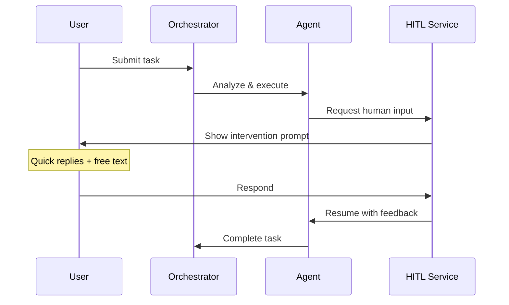

# Human-In-The-Loop (HITL)

DEVS supports **Human-In-The-Loop** interventions during task orchestration, allowing agents to pause execution and request user feedback before proceeding. This enables human oversight at critical decision points while maintaining autonomous agent workflows.

## Overview



## Core Concepts

### HITL Request

An agent (or the orchestrator) can create an **HITL request** when it needs human input. Each request contains:

| Field | Type | Description |
|-------|------|-------------|
| `id` | `string` | Unique identifier |
| `conversationId` | `string` | Conversation where the request appears |
| `agentId` | `string` | Agent requesting input |
| `type` | `HitlRequestType` | Category of intervention |
| `question` | `string` | What the agent is asking |
| `quickReplies` | `HitlQuickReply[]` | Pre-filled response options |
| `status` | `HitlStatus` | `pending` / `answered` / `dismissed` / `auto-resolved` |
| `response` | `string?` | User's text answer |

### Request Types

| Type | When Used |
|------|-----------|
| `approval` | Agent needs permission to proceed (e.g., "Should I execute this plan?") |
| `clarification` | Agent needs more information (e.g., "Which framework do you prefer?") |
| `choice` | Agent presents options (e.g., "Pick an architecture pattern") |
| `confirmation` | Agent wants to verify understanding (e.g., "Is this what you meant?") |
| `feedback` | Agent requests quality feedback (e.g., "Does this draft meet your needs?") |

### Quick Replies

Each HITL request can include pre-filled quick reply buttons:

```typescript
interface HitlQuickReply {
  label: string    // Button text
  value: string    // Value sent as the response
  color?: string   // HeroUI color: 'primary' | 'success' | 'danger' | 'warning'
}
```

Quick replies appear as clickable buttons below the question. Users can also type a free-text response instead.

### YOLO Mode

**YOLO Mode** (You Only Live Once) is a global setting that auto-resolves all HITL requests without user intervention. When enabled:

- Approval requests → auto-approved
- Clarification requests → auto-resolved with "Proceed with your best judgment"
- Choice requests → auto-resolved with the first option
- Confirmation requests → auto-confirmed
- Feedback requests → auto-resolved with "Looks good, proceed"

YOLO Mode is configured in **Settings → Features → Automation**.

```
Settings → Features → Automation
  ┌──────────────────────────────────┐
  │ ☐ YOLO Mode                      │
  │   Skip all human intervention    │
  │   prompts and let agents decide  │
  │   autonomously.                  │
  └──────────────────────────────────┘
```

## Architecture

### Components

```
src/
├── lib/
│   └── hitl.ts                    # HITL service (create, resolve, auto-resolve)
├── types/
│   └── index.ts                   # HitlRequest, HitlQuickReply, HitlStatus types
├── stores/
│   └── userStore.ts               # YOLO mode setting (SyncedSettings)
├── components/
│   └── HitlPrompt.tsx             # UI component for rendering HITL in chat
└── pages/
    └── Settings/components/
        └── FeaturesSection.tsx     # YOLO mode toggle
```

### HITL Service (`src/lib/hitl.ts`)

The HITL service provides a Promise-based API for agents to request human input:

```typescript
import { requestHumanInput } from '@/lib/hitl'

// Agent requests input — returns a Promise that resolves when user responds
const response = await requestHumanInput({
  conversationId: 'conv-123',
  agentId: 'agent-456',
  type: 'approval',
  question: 'I\'ve analyzed the requirements. Should I proceed with implementation?',
  quickReplies: [
    { label: 'Approve', value: 'approved', color: 'success' },
    { label: 'Reject', value: 'rejected', color: 'danger' },
    { label: 'Modify Plan', value: 'modify' },
  ],
})

// response.status: 'answered' | 'dismissed' | 'auto-resolved'
// response.value: 'approved' | 'rejected' | 'modify' | free-text
```

### YOLO Mode Behavior

When `yoloMode` is enabled in user settings, `requestHumanInput()` resolves immediately with an auto-generated response based on the request type:

| Request Type | Auto-Resolution |
|-------------|-----------------|
| `approval` | First quick reply with `color: 'success'`, or first reply, or `"approved"` |
| `clarification` | `"Proceed with your best judgment"` |
| `choice` | First quick reply value |
| `confirmation` | `"confirmed"` |
| `feedback` | `"Looks good, proceed"` |

### Message Integration

HITL requests appear as special system messages in the conversation timeline. The `HitlPrompt` component renders:

1. The agent's question (markdown supported)
2. Quick reply buttons (if provided)
3. A text input for free-text responses
4. Status indicator (pending/answered/auto-resolved)

Once answered, the response is displayed inline and the buttons are disabled.

## Usage in Orchestration

### Agent-Level HITL

Agents can request human input during their execution loop:

```typescript
// In agent-runner.ts or tool execution
const feedback = await requestHumanInput({
  conversationId,
  agentId: agent.id,
  type: 'approval',
  question: 'The analysis is complete. Here is the plan:\n\n' + plan + '\n\nShould I proceed?',
  quickReplies: [
    { label: 'Yes, proceed', value: 'proceed', color: 'success' },
    { label: 'No, revise', value: 'revise', color: 'warning' },
    { label: 'Cancel', value: 'cancel', color: 'danger' },
  ],
})
```

### Orchestrator-Level HITL

The orchestrator can pause between phases:

```typescript
// In engine.ts — after task decomposition
const approval = await requestHumanInput({
  conversationId,
  agentId: leadAgent.id,
  type: 'approval',
  question: `Task decomposed into ${subtasks.length} subtasks. Proceed?`,
  quickReplies: [
    { label: 'Execute', value: 'execute', color: 'success' },
    { label: 'Review Details', value: 'review' },
    { label: 'Cancel', value: 'cancel', color: 'danger' },
  ],
})
```

## Integration with Approval Gates

HITL complements the existing **Approval Gate** system used for background queue tasks:

| Feature | Approval Gates | HITL |
|---------|---------------|------|
| **Scope** | Background queue tasks | Any conversation/task |
| **UI** | Queue management panel | Inline in chat |
| **Interaction** | Approve/Reject | Text + quick replies |
| **YOLO Mode** | `autoApprovePolicy: 'always'` | `yoloMode: true` |

When YOLO mode is enabled, both systems auto-approve:
- Approval gates use `autoApprovePolicy: 'always'`
- HITL requests auto-resolve based on type

## Settings

| Setting | Location | Default | Description |
|---------|----------|---------|-------------|
| `yoloMode` | `SyncedSettings` | `false` | Auto-resolve all HITL requests |

YOLO mode syncs across devices via Yjs, so enabling it on one device applies to all connected devices.
