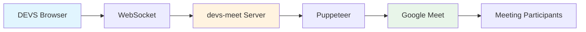
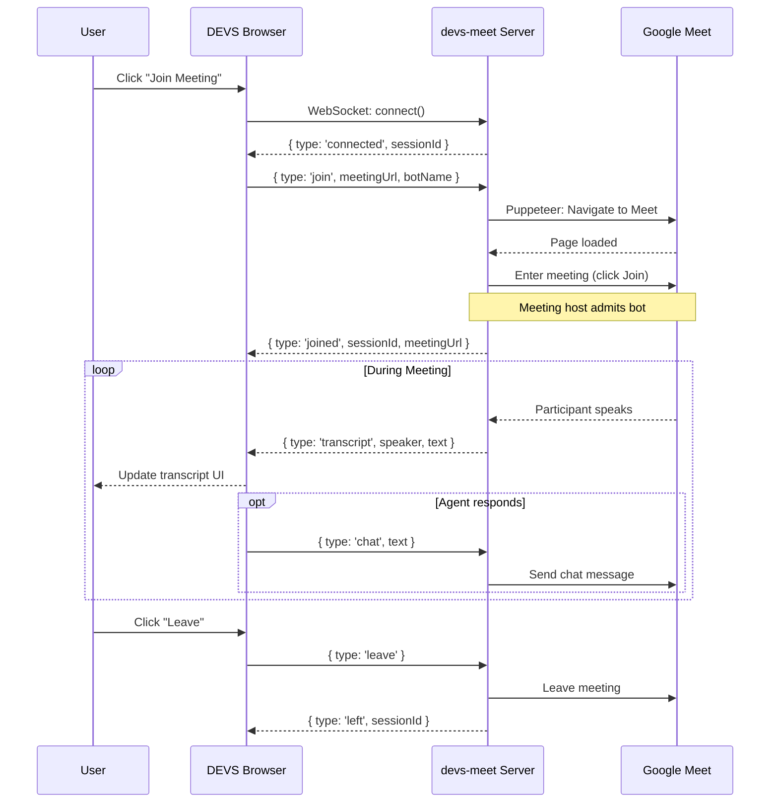

# Meeting Bot - Google Meet Agent Integration

DEVS enables AI agents to join Google Meet meetings as real participants, providing live transcription, note-taking, and interactive AI assistance during calls.

## Overview

The Meeting Bot feature allows DEVS agents to:

- **Join Google Meet meetings** as authenticated participants
- **Capture live transcripts** of meeting conversations
- **Respond to questions** via chat or voice
- **React with emojis** during meetings
- **Take notes** and summarize discussions



## Architecture

### Components

```
src/features/meeting-bot/
├── types.ts                    # Type definitions
├── meet-bridge.ts              # WebSocket client to devs-meet server
├── index.ts                    # Feature exports
├── components/
│   ├── MeetingBotPanel.tsx     # Main UI panel
│   ├── MeetingControls.tsx     # Meeting action buttons
│   └── MeetingTranscript.tsx   # Live transcript display
└── hooks/
    ├── useMeetingBot.ts        # Core bot hook
    └── useMeetingSession.ts    # Session management with auth
```

### External Dependencies

| Component               | Purpose                                                                          |
| ----------------------- | -------------------------------------------------------------------------------- |
| **devs-meet**           | Node.js server running Puppeteer to control a Chrome browser that joins meetings |
| **Google Calendar API** | Fetches upcoming meetings with Google Meet links                                 |
| **Google OAuth**        | Authenticates the user for seamless meeting joins                                |

## Setup

### 1. Connect Google Account

Navigate to **Connectors** and add the **Google Meet** connector:

1. Click "Add Connector"
2. Select "Google Meet"
3. Authorize calendar access (to list upcoming meetings)

> **Note:** Google Meet is a "connection-only" connector—it doesn't sync content to your Knowledge Base like Google Drive does.

### 2. Start the devs-meet Server

The meeting bot requires an external server to control the browser:

```bash
# Clone the devs-meet repository
git clone https://github.com/yourorg/devs-meet.git
cd devs-meet

# Install dependencies
npm install

# Start the server
npm start
```

The server runs on `ws://localhost:4445` by default.

### 3. Configure Environment

Set the `VITE_GOOGLE_CLIENT_ID` environment variable for OAuth:

```env
VITE_GOOGLE_CLIENT_ID=your-google-client-id.apps.googleusercontent.com
```

## Usage

### Basic Usage

```tsx
import { MeetingBotPanel } from '@/features/meeting-bot'

function MyComponent() {
  return (
    <MeetingBotPanel
      agentId="agent-123"
      agentName="Meeting Assistant"
      serverUrl="ws://localhost:4445"
      onTranscriptUpdate={(transcript) => {
        console.log('New transcript:', transcript)
      }}
    />
  )
}
```

### Using the Hook Directly

```tsx
import { useMeetingSession } from '@/features/meeting-bot'

function MyMeetingComponent() {
  const {
    status,
    transcript,
    participants,
    upcomingMeetings,
    connect,
    joinMeeting,
    joinMeetingWithAuth,
    leaveMeeting,
    speak,
    sendChat,
    react,
  } = useMeetingSession({
    agentId: 'agent-123',
    agentName: 'Meeting Assistant',
    onTranscript: (entry) => {
      console.log(`${entry.speaker}: ${entry.text}`)
    },
    onAgentShouldRespond: async (entry) => {
      // Return a string to have the agent respond
      if (entry.text.includes('@assistant')) {
        return 'How can I help you?'
      }
      return null
    },
  })

  // Join an upcoming meeting with authentication
  const handleJoin = async (meeting) => {
    await connect()
    await joinMeetingWithAuth(meeting)
  }

  return (
    <div>
      <p>Status: {status}</p>
      <button onClick={() => sendChat('Hello everyone!')}>Say Hello</button>
    </div>
  )
}
```

## API Reference

### Types

#### MeetingBotStatus

```typescript
type MeetingBotStatus =
  | 'disconnected' // Not connected to devs-meet server
  | 'connecting' // Establishing WebSocket connection
  | 'connected' // Connected, ready to join meetings
  | 'joining' // Bot is joining the meeting
  | 'waiting' // Waiting to be admitted (lobby)
  | 'joined' // Successfully in the meeting
  | 'leaving' // Leaving the meeting
  | 'error' // An error occurred
```

#### TranscriptEntry

```typescript
interface TranscriptEntry {
  id: string
  speaker: string // Name of the speaker
  text: string // What was said
  timestamp: Date // When it was said
  isAgent?: boolean // True if this was the AI agent speaking
}
```

#### MeetingParticipant

```typescript
interface MeetingParticipant {
  id: string
  name: string
  joinedAt: Date
  leftAt?: Date // Set when participant leaves
}
```

#### MeetMeetingInfo

```typescript
interface MeetMeetingInfo {
  id: string
  title: string
  startTime?: Date
  endTime?: Date
  meetUrl: string // The meet.google.com URL
  calendarEventId?: string // Associated calendar event
}
```

### useMeetingSession Hook

#### Options

| Option                 | Type                                                  | Description                                                     |
| ---------------------- | ----------------------------------------------------- | --------------------------------------------------------------- |
| `agentId`              | `string`                                              | Required. ID of the agent joining the meeting                   |
| `agentName`            | `string`                                              | Required. Display name for the bot in the meeting               |
| `serverUrl`            | `string`                                              | Optional. devs-meet server URL (default: `ws://localhost:4445`) |
| `onTranscript`         | `(entry: TranscriptEntry) => void`                    | Optional. Callback for each transcript entry                    |
| `onAgentShouldRespond` | `(entry: TranscriptEntry) => Promise<string \| null>` | Optional. Return a string to have the agent respond             |

#### Return Values

| Property              | Type                                          | Description                             |
| --------------------- | --------------------------------------------- | --------------------------------------- |
| `status`              | `MeetingBotStatus`                            | Current connection/meeting status       |
| `transcript`          | `TranscriptEntry[]`                           | Full transcript of the meeting          |
| `participants`        | `MeetingParticipant[]`                        | Current and past participants           |
| `errorMessage`        | `string \| null`                              | Error message if status is 'error'      |
| `upcomingMeetings`    | `MeetMeetingInfo[]`                           | Upcoming meetings from calendar         |
| `loadingMeetings`     | `boolean`                                     | True while loading meetings             |
| `connectorConnected`  | `boolean`                                     | True if Google Meet connector is set up |
| `connect`             | `() => Promise<void>`                         | Connect to the devs-meet server         |
| `disconnect`          | `() => void`                                  | Disconnect from the server              |
| `joinMeeting`         | `(url: string) => Promise<void>`              | Join a meeting by URL (guest mode)      |
| `joinMeetingWithAuth` | `(meeting: MeetMeetingInfo) => Promise<void>` | Join with Google authentication         |
| `leaveMeeting`        | `() => void`                                  | Leave the current meeting               |
| `speak`               | `(text: string) => void`                      | Speak via text-to-speech (if supported) |
| `sendChat`            | `(text: string) => void`                      | Send a chat message                     |
| `react`               | `(emoji: string) => void`                     | React with an emoji                     |
| `refreshMeetings`     | `() => Promise<void>`                         | Refresh upcoming meetings list          |

## WebSocket Protocol

### Client → Server Messages

```typescript
// Join a meeting
{ type: 'join', meetingUrl: string, botName: string, googleAuthToken?: unknown }

// Leave the current meeting
{ type: 'leave' }

// Speak (TTS) or send audio
{ type: 'speak', text?: string, audioBase64?: string }

// Send a chat message
{ type: 'chat', text: string }

// React with emoji
{ type: 'react', emoji: string }

// Keep-alive ping
{ type: 'ping' }
```

### Server → Client Messages

```typescript
// Connection established
{ type: 'connected', sessionId: string }

// Successfully joined meeting
{ type: 'joined', sessionId: string, meetingUrl: string }

// Left the meeting
{ type: 'left', sessionId: string }

// Transcript from meeting
{ type: 'transcript', speaker: string, text: string, timestamp: number, sessionId: string }

// Participant joined/left
{ type: 'participant', action: 'joined' | 'left', name: string, id: string, timestamp: number, sessionId: string }

// Status update
{ type: 'status', status: string, message: string }

// Keep-alive pong
{ type: 'pong', timestamp: number }

// Error occurred
{ type: 'error', error: string }
```

## Flow Diagram



## Security Considerations

### Token Handling

- OAuth tokens are encrypted at rest using Web Crypto API
- Refresh tokens are stored separately with their own encryption
- Tokens are only decrypted when needed for API calls

### Privacy

- All meeting data stays in the browser (IndexedDB)
- Transcripts are not sent to any external servers except Google Meet
- The devs-meet server runs locally by default

### Permissions

The Google Meet connector requests these OAuth scopes:

| Scope               | Purpose                                |
| ------------------- | -------------------------------------- |
| `calendar.readonly` | Read upcoming meetings with Meet links |
| `userinfo.email`    | Get user's email for display           |
| `userinfo.profile`  | Get user's name for display            |

## Troubleshooting

### "Connection Failed" Error

1. Ensure the devs-meet server is running on the correct port
2. Check that WebSocket connections are not blocked by firewall
3. Verify the `serverUrl` prop matches the server address

### "Waiting to be Admitted" Takes Too Long

The meeting host needs to manually admit the bot from the meeting lobby. The bot will appear as the configured agent name.

### "No Upcoming Meetings"

1. Verify the Google Meet connector is connected
2. Check that your calendar has events with Google Meet links
3. Only future meetings are shown—past meetings are filtered out

### Transcript Not Appearing

1. Ensure participants are speaking (not muted)
2. Chrome's speech recognition must be working
3. The devs-meet server needs proper audio capture setup

## Limitations

- **One meeting at a time** - Each devs-meet server can only join one meeting
- **Chrome required** - The server uses Puppeteer with Chrome
- **Manual admission** - Most meetings require host to admit the bot
- **No screen sharing** - Bot cannot view shared screens (only audio/transcript)

## Related Documentation

- [Connectors](./CONNECTORS.md) - How the Google Meet connector works
- [DEVS Architecture](../ARCHITECTURE.md) - Overall system architecture
