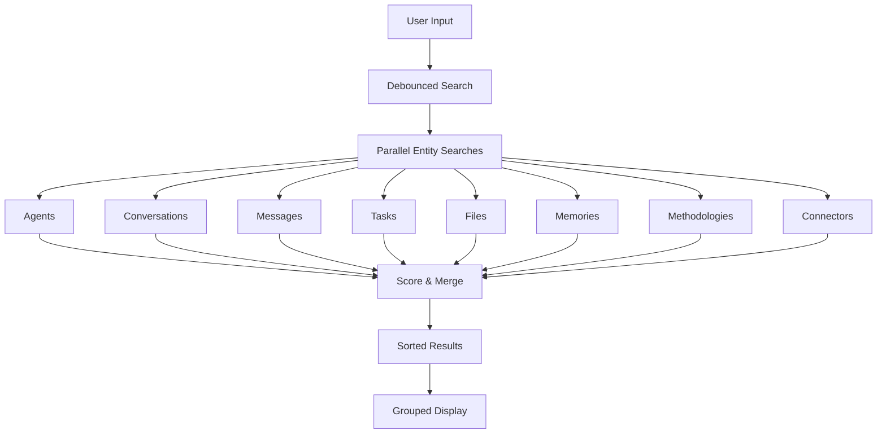

# Global Search

The Global Search feature provides a unified, fast search experience across all DEVS entities. It enables users to quickly find agents, conversations, tasks, files, memories, messages, methodologies, and connectors from a single modal interface.

## Overview

Global Search is designed following Google-like simplicity principles—accessible via a single keyboard shortcut with instant results grouped by category.



## Activation

### Keyboard Shortcut

- **macOS**: `Cmd + K`
- **Windows/Linux**: `Ctrl + K`

The shortcut uses the capture phase to work even when focus is in form fields.

### Programmatic Access

```typescript
import { useSearchStore } from '@/features/search'

// Open search modal
const { open } = useSearchStore()
open()
```

## Architecture

### File Structure

```
src/features/search/
├── GlobalSearch.tsx      # Main UI component
├── search-engine.ts      # Search logic and scoring
├── searchStore.ts        # Zustand state management
└── index.ts              # Public exports
```

### Components

#### GlobalSearch Component

The main modal interface that provides:

- **Search input** with debounced query handling
- **Recent history** view when no query is entered (grouped by date)
- **Grouped results** display with type-based sections
- **Keyboard navigation** (Arrow keys + Enter)
- **Quick actions** (New task shortcut)

#### Search Engine

The search engine (`search-engine.ts`) handles:

- Parallel searching across all entity types
- Diacritic-insensitive text matching (e.g., "café" matches "cafe")
- Score-based result ranking
- Configurable result limits

#### Search Store

Zustand store (`searchStore.ts`) manages:

- Modal open/close state
- Query text
- Search results
- Loading state
- Keyboard selection index

## Search Configuration

```typescript
const SEARCH_CONFIG = {
  MAX_RESULTS: 20, // Maximum results returned
  MIN_QUERY_LENGTH: 2, // Minimum characters to trigger search
  DEBOUNCE_MS: 200, // Input debounce delay
  SCORE_WEIGHTS: {
    titleMatch: 10, // Substring match in title
    exactMatch: 15, // Exact match bonus
    startsWith: 8, // Starts-with match bonus
    contentMatch: 3, // Match in secondary content
    recency: 5, // Recent items bonus (< 7 days)
  },
}
```

## Searchable Entities

| Entity        | Searchable Fields              | Icon                  | Base Score |
| ------------- | ------------------------------ | --------------------- | ---------- |
| Agents        | name, role, description, tags  | `Sparks`              | 5          |
| Conversations | title, summary                 | `ChatBubble`          | 3          |
| Messages      | content                        | `ChatLines`           | 1          |
| Tasks         | title, description             | `PcCheck`.            | 4          |
| Files         | name, description, path, tags  | `Folder` / `Document` | 2          |
| Memories      | title, content, keywords, tags | `Brain`               | 2          |
| Methodologies | name, description, tags        | `Strategy`            | 3          |
| Connectors    | name, provider, category       | `Puzzle`              | 2          |

## Scoring Algorithm

Results are ranked using a multi-factor scoring system:

### Text Matching Scores

1. **Exact match** (+15): Query exactly matches the field
2. **Starts with** (+8): Field starts with the query
3. **Contains** (+10): Query found as substring

### Recency Bonus

Items modified within the last 7 days receive a recency bonus:

```typescript
// Bonus decays linearly over 7 days
if (daysSince < 7) {
  score += SCORE_WEIGHTS.recency * (1 - daysSince / 7)
}
```

### Base Scores by Type

Different entity types have different base scores to influence default ordering:

- **Agents**: 5 (highest priority)
- **Tasks**: 4
- **Conversations/Methodologies**: 3
- **Files/Memories/Connectors**: 2
- **Messages**: 1 (lowest to avoid flooding results)

## Diacritic-Insensitive Search

Search automatically normalizes text to handle accented characters:

```typescript
function normalizeText(text: string): string {
  return text
    .normalize('NFD')
    .replace(/[\u0300-\u036f]/g, '')
    .toLowerCase()
}
```

**Examples:**

- "café" matches "cafe"
- "résumé" matches "resume"
- "naïve" matches "naive"
- "Müller" matches "muller"

## Keyboard Navigation

| Key      | Action                      |
| -------- | --------------------------- |
| `↓`      | Select next result          |
| `↑`      | Select previous result      |
| `Enter`  | Navigate to selected result |
| `Escape` | Close search modal          |

Navigation wraps around—pressing down on the last item selects the first.

## Default View (No Query)

When the search modal opens without a query, it displays:

1. **New Task** action button
2. **Recent History** grouped by date:
   - Today, Yesterday, This Week, etc.
   - Combined tasks and conversations
   - Sorted by most recently updated
   - Limited to 15 items

## Result Display

Results are grouped by type in sections:

```
┌─────────────────────────────────────┐
│ 🔍 Search tasks, conversations...   │
├─────────────────────────────────────┤
│ Agents                              │
│   ⚡ Einstein - Physicist           │
│   ⚡ Da Vinci - Polymath            │
├─────────────────────────────────────┤
│ Tasks                               │
│   🚩 Build search feature - pending │
├─────────────────────────────────────┤
│ Conversations                       │
│   💬 API Design Discussion          │
└─────────────────────────────────────┘
```

## Internationalization

The search feature supports multiple languages:

- **English** (en)
- **Arabic** (ar) - with RTL support
- **German** (de)
- **Spanish** (es)
- **French** (fr)
- **Korean** (ko)

Translations cover:

- Placeholder text
- Section titles (Agents, Tasks, etc.)
- Type labels
- Action buttons
- Empty state messages

## Usage Examples

### Basic Search

```typescript
import { globalSearch } from '@/features/search'

const results = await globalSearch('einstein')
// Returns matching agents, conversations, etc.
```

### Debounced Search

```typescript
import { createDebouncedSearch } from '@/features/search'

const debouncedSearch = createDebouncedSearch(async (query) => {
  const results = await globalSearch(query)
  setResults(results)
}, 200)

// Call on input change
debouncedSearch(inputValue)
```

### Accessing Search State

```typescript
import { useSearchStore } from '@/features/search'

function MyComponent() {
  const { isOpen, query, results, isSearching } = useSearchStore()

  // Use state in your component
}
```

### Registering the Shortcut

```typescript
import { useGlobalSearchShortcut } from '@/features/search'

function App() {
  // Register Cmd+K / Ctrl+K globally
  useGlobalSearchShortcut()

  return <Layout />
}
```

## Performance Optimizations

1. **Parallel Search**: All entity searches run concurrently via `Promise.all`
2. **Debounced Input**: 200ms debounce prevents excessive searches
3. **Minimum Query Length**: Requires 2+ characters to search
4. **Result Limiting**: Maximum 20 results returned
5. **Early Exit**: Empty queries return immediately
6. **Graceful Degradation**: Individual search failures don't break overall search

## Error Handling

Each entity search is wrapped in try-catch:

```typescript
try {
  // Search logic
} catch (error) {
  console.warn('Failed to search agents:', error)
}
```

Failures in one category don't affect other categories—users still see results from successful searches.

## Data Sources

| Entity        | Source                           |
| ------------- | -------------------------------- |
| Agents        | Built-in JSON + IndexedDB        |
| Conversations | IndexedDB `conversations` store  |
| Messages      | Nested in conversations          |
| Tasks         | IndexedDB `tasks` store          |
| Files         | IndexedDB `knowledgeItems` store |
| Memories      | IndexedDB `agentMemories` store  |
| Methodologies | Built-in YAML files              |
| Connectors    | IndexedDB `connectors` store     |

## Color Coding

Each result type has a distinct color for visual differentiation:

| Type         | Color Class        | Visual     |
| ------------ | ------------------ | ---------- |
| Agent        | `text-warning`     | Yellow     |
| Conversation | `text-default-500` | Gray       |
| Task         | `text-secondary`   | Purple     |
| File         | `text-primary`     | Blue       |
| Memory       | `text-success`     | Green      |
| Message      | `text-default-400` | Light Gray |
| Methodology  | `text-success`     | Green      |
| Connector    | `text-primary`     | Blue       |

## API Reference

### Types

```typescript
type SearchResultType =
  | 'agent'
  | 'conversation'
  | 'task'
  | 'file'
  | 'memory'
  | 'message'
  | 'methodology'
  | 'connector'

interface SearchResult {
  id: string
  type: SearchResultType
  title: string
  subtitle?: string
  icon: string
  color: string
  href: string
  score: number
  timestamp?: Date
  parentId?: string // For messages: parent conversation ID
}
```

### Exports

```typescript
// Components
export { GlobalSearch, useGlobalSearchShortcut } from './GlobalSearch'

// Store
export { useSearchStore } from './searchStore'

// Search functions
export {
  globalSearch,
  createDebouncedSearch,
  getResultIcon,
  getResultColor,
  type SearchResult,
  type SearchResultType,
} from './search-engine'
```
