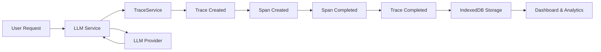

# Traces - LLM Observability & Analytics

DEVS includes a comprehensive tracing system for monitoring, analyzing, and debugging all LLM interactions. This feature provides real-time visibility into AI operations, cost tracking, and performance metrics.

## Overview

The Traces feature captures every LLM request made through DEVS, recording:

- **Request/Response data** - Full conversation context and model outputs
- **Token usage** - Input and output token counts
- **Cost estimates** - Real-time cost calculation using up-to-date pricing
- **Performance metrics** - Latency, duration percentiles (P50, P95, P99)
- **Error tracking** - Failed requests with error messages



## Architecture

### Core Components

| Component          | File                                                                                                      | Description                                   |
| ------------------ | --------------------------------------------------------------------------------------------------------- | --------------------------------------------- |
| **TraceService**   | [src/features/traces/trace-service.ts](../src/features/traces/trace-service.ts)                           | Core service for creating and managing traces |
| **TraceStore**     | [src/stores/traceStore.ts](../src/stores/traceStore.ts)                                                   | Zustand store for UI state management         |
| **TraceDashboard** | [src/features/traces/components/TraceDashboard.tsx](../src/features/traces/components/TraceDashboard.tsx) | Analytics dashboard with charts               |
| **TraceList**      | [src/features/traces/components/TraceList.tsx](../src/features/traces/components/TraceList.tsx)           | Trace listing with filtering                  |

### Data Model

#### Trace

A trace represents a complete LLM request from start to finish:

```typescript
interface Trace {
  id: string
  name: string // e.g., "openai/gpt-4o"
  status: TraceStatus // 'pending' | 'running' | 'completed' | 'error'

  // Timing
  startTime: Date
  endTime?: Date
  duration?: number // Total duration in milliseconds

  // Aggregated stats
  totalTokens?: number
  totalPromptTokens?: number // Input tokens
  totalCompletionTokens?: number // Output tokens
  totalCost?: CostEstimate
  spanCount: number

  // Context
  sessionId?: string // Groups traces in a session
  agentId?: string
  conversationId?: string

  // Model info
  primaryModel?: ModelInfo

  // Input/Output summary
  input?: string // Summary of input (first 200 chars)
  output?: string // Summary of output (first 200 chars)
}
```

#### Span

A span represents a single operation within a trace (similar to OpenTelemetry spans):

```typescript
interface Span {
  id: string
  traceId: string
  parentSpanId?: string // For nested spans
  name: string
  type: SpanType // 'llm' | 'agent' | 'tool' | 'chain' | 'retrieval' | 'embedding' | 'custom'
  status: TraceStatus

  // Timing
  startTime: Date
  endTime?: Date
  duration?: number

  // Model & Usage (for LLM spans)
  model?: ModelInfo
  usage?: TokenUsage
  cost?: CostEstimate

  // Input/Output
  io?: SpanIO
}
```

## Features

### 1. Dashboard Analytics

The traces dashboard provides at-a-glance metrics:

**Key Metrics:**

- Total requests count
- Success rate percentage
- Total tokens consumed
- Total cost in USD

**Performance Metrics:**

- Average duration
- P50, P95, P99 latency percentiles

**Distribution Charts:**

- Model usage distribution
- Provider usage distribution
- Daily trends (traces, tokens, cost, errors)

### 2. Request Logging

View all LLM requests with:

- Model and provider information
- Status (completed/error/running)
- Token usage breakdown (input → output → total)
- Cost per request
- Duration
- Timestamp

### 3. Session Grouping

Traces are automatically grouped by session, allowing you to:

- View all requests from a single conversation
- Track total session cost and tokens
- Analyze conversation patterns

### 4. Detailed Trace View

Click any trace to see:

- Full request/response content
- Span hierarchy
- Token usage breakdown
- Cost calculation details
- Error messages (if failed)

### 5. Cost Tracking

Cost is calculated using up-to-date pricing from the [LiteLLM pricing catalog](https://github.com/BerriAI/litellm):

```typescript
// Pricing is loaded from LiteLLM's catalog
// Falls back to conservative estimates if unavailable
const FALLBACK_PRICING = {
  'gpt-4o': { input: 2.5, output: 10 }, // USD per 1M tokens
  'gpt-4o-mini': { input: 0.15, output: 0.6 },
  'claude-sonnet-4': { input: 3, output: 15 },
  'gemini-2.0-flash': { input: 0.1, output: 0.4 },
  // ... more models
}
```

## Configuration

### Tracing Settings

Access settings via the Traces page → Settings button:

| Setting            | Default | Description                             |
| ------------------ | ------- | --------------------------------------- |
| **Enabled**        | `true`  | Enable/disable tracing                  |
| **Capture Input**  | `true`  | Store full input messages               |
| **Capture Output** | `true`  | Store full responses                    |
| **Sampling Rate**  | `1.0`   | Percentage of requests to trace (0-1)   |
| **Retention Days** | `30`    | Days to keep traces (0 = forever)       |
| **Max Traces**     | `10000` | Maximum traces to store (0 = unlimited) |

### Configuration API

```typescript
import { TraceService } from '@/features/traces'

// Update configuration
await TraceService.updateConfig({
  enabled: true,
  retentionDays: 14,
  samplingRate: 0.5, // Sample 50% of requests
})

// Get current configuration
const config = TraceService.getConfig()
```

## Usage

### Automatic Tracing

All LLM calls through the DEVS LLM service are automatically traced:

```typescript
// This is handled internally by the LLM service
// No additional code needed for basic tracing
```

### Manual Tracing

For custom operations, use the TraceService API:

```typescript
import { TraceService } from '@/features/traces'

// Start a trace
const trace = TraceService.startTrace({
  name: 'Custom Operation',
  agentId: 'my-agent',
  conversationId: 'conv-123',
  input: 'User query...',
})

// Start a span within the trace
const span = TraceService.startSpan({
  traceId: trace.id,
  name: 'LLM Call',
  type: 'llm',
  model: {
    provider: 'openai',
    model: 'gpt-4o',
  },
  io: {
    input: { messages: [...] },
  },
})

// ... perform operation ...

// End span with results
await TraceService.endSpan(span.id, {
  status: 'completed',
  usage: { promptTokens: 100, completionTokens: 50, totalTokens: 150 },
  output: { content: 'Response...' },
})

// End trace
await TraceService.endTrace(trace.id, {
  status: 'completed',
  output: 'Summary of response...',
})
```

### Streaming LLM Calls

For streaming responses:

```typescript
const { traceId, spanId, onChunk, onComplete, onError } =
  TraceService.trackStreamingLLMCall(config, messages, {
    agentId,
    conversationId,
  })

// Call onChunk for each streamed chunk
stream.on('chunk', (chunk) => onChunk(chunk))

// Call onComplete when done
stream.on('end', () => onComplete(fullResponse, usage))

// Call onError on failure
stream.on('error', (error) => onError(error))
```

## Querying Traces

### Get Traces with Filters

```typescript
import { TraceService } from '@/features/traces'

const traces = await TraceService.getTraces({
  status: 'completed',
  provider: 'openai',
  agentId: 'my-agent',
  startDate: new Date('2025-01-01'),
  endDate: new Date('2025-01-31'),
})
```

### Get Metrics

```typescript
// Get metrics for a time period
const metrics = await TraceService.getMetrics('day') // 'hour' | 'day' | 'week' | 'month' | 'all'

console.log(metrics.totalTraces)
console.log(metrics.totalCost)
console.log(metrics.averageDuration)

// Get daily metrics for charts
const dailyMetrics = await TraceService.getDailyMetrics(30) // Last 30 days
```

### Get Trace Details

```typescript
// Get a single trace
const trace = await TraceService.getTrace(traceId)

// Get spans for a trace
const spans = await TraceService.getSpansForTrace(traceId)
```

## Data Management

### Delete Traces

```typescript
// Delete a single trace
await TraceService.deleteTrace(traceId)

// Clear all traces
await TraceService.clearAllTraces()
```

### Automatic Cleanup

The TraceService includes automatic cleanup based on retention settings:

```typescript
// Clean up traces older than retention period
const deletedCount = await TraceService.cleanupOldTraces()

// Enforce maximum traces limit
const deletedCount = await TraceService.enforceMaxTraces()
```

## UI Navigation

Access the Traces feature from:

- **App Drawer** → Traces icon
- **Direct URL** → `/traces`

### Tabs

| Tab       | URL                | Description                    |
| --------- | ------------------ | ------------------------------ |
| Dashboard | `/traces`          | Analytics overview with charts |
| Logs      | `/traces/logs`     | Detailed trace list            |
| Sessions  | `/traces/sessions` | Traces grouped by session      |

### Trace Detail View

Click any trace to view details at `/traces/logs/{traceId}`:

- Full request/response content
- Span breakdown
- Token and cost details
- Metadata and tags

## Privacy & Storage

- **All data stored locally** in IndexedDB
- **No server uploads** - traces never leave your device
- **Configurable retention** - automatically delete old traces
- **Full control** - clear all data at any time

## Best Practices

1. **Set appropriate retention** - Balance history needs with storage limits
2. **Use sampling for high-volume** - Set sampling rate < 1.0 if tracing too many requests
3. **Monitor costs regularly** - Use the dashboard to track spending trends
4. **Review errors** - Check error traces to identify and fix issues
5. **Group by session** - Use session view for analyzing conversation flows

## Troubleshooting

### Traces Not Appearing

1. Check if tracing is enabled: Settings → Traces → Enabled
2. Verify sampling rate is > 0
3. Check browser console for errors

### Incorrect Cost Estimates

Cost estimates use the LiteLLM pricing catalog. If pricing seems incorrect:

1. The model may not be in the catalog (falls back to defaults)
2. Pricing may have changed - catalog is loaded once per session

### High Storage Usage

If traces are using too much storage:

1. Reduce retention days
2. Lower the max traces limit
3. Disable input/output capture for sensitive data
4. Clear old traces manually

## Related Documentation

- [AGENTS.md](../AGENTS.md) - Overall project documentation
- [ARCHITECTURE.md](../ARCHITECTURE.md) - System architecture
