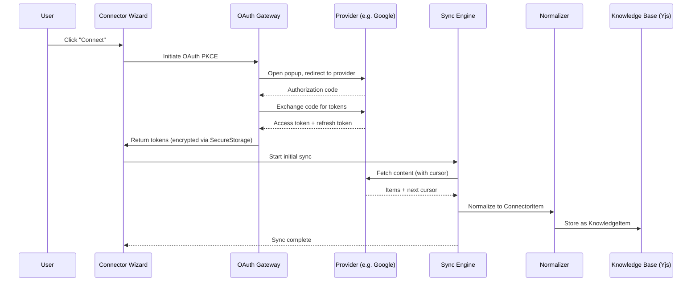

# Connectors - External Services Integration

> **Status**: Implemented
> **Category**: Feature
> **Location**: `src/features/connectors/`

## Overview

Connectors enable DEVS to integrate with external services, importing content into the Knowledge Base and providing agents with access to external data sources. The system currently supports **14 OAuth-based app connectors** with delta sync, encrypted token storage, and content normalization. API and MCP connector categories are defined in the type system but not yet implemented.

---

## Connector Categories

| Category | Auth Method      | Examples                                       | Status              |
| -------- | ---------------- | ---------------------------------------------- | ------------------- |
| **Apps** | OAuth 2.0 PKCE   | Google Drive, Gmail, Notion, Slack, Figma, etc | Implemented (14)    |
| **APIs** | API Key / Bearer | Custom REST/GraphQL endpoints                  | Types defined       |
| **MCPs** | MCP Protocol     | Local/Remote MCP servers                       | Types defined       |

---

## Implemented Providers

### App Connectors (OAuth 2.0)

| Provider            | File                    | Capabilities   | Content Types                    |
| ------------------- | ----------------------- | -------------- | -------------------------------- |
| **Google Drive**    | `google-drive.ts`       | read, search   | All file types                   |
| **Gmail**           | `gmail.ts`              | read, search   | Emails                           |
| **Google Calendar** | `google-calendar.ts`    | read, search   | Events                           |
| **Google Chat**     | `google-chat.ts`        | read, search   | Messages, spaces                 |
| **Google Meet**     | `google-meet.ts`        | read           | Meetings                         |
| **Google Tasks**    | `google-tasks.ts`       | read           | Tasks, task lists                |
| **Notion**          | `notion.ts`             | read, search   | Pages, databases                 |
| **Dropbox**         | `dropbox.ts`            | read, search   | All file types                   |
| **Slack**           | `slack.ts`              | read, search   | Messages, channels, files        |
| **Outlook Mail**    | `outlook-mail.ts`       | read, search   | Emails                           |
| **OneDrive**        | `onedrive.ts`           | read, search   | All file types                   |
| **Qonto**           | `qonto.ts`              | read           | Accounts, transactions           |
| **Figma**           | `figma.ts`              | read, search   | Files, projects                  |

> **Note:** `github` is declared in the `AppConnectorProvider` type union and has config in `APP_CONNECTOR_CONFIGS`, but **no provider implementation file exists**. It is not functional.

---

## Architecture

```
src/features/connectors/
├── index.ts                    # Public exports & provider initialization
├── types.ts                    # All connector types & constants
├── connector-provider.ts       # BaseAppConnectorProvider (fetchWithAuth, token refresh)
├── oauth-gateway.ts            # OAuth 2.0 PKCE flow (popup, token exchange)
├── provider-registry.ts        # Lazy-loaded provider management
├── sync-engine.ts              # Delta sync orchestration & job queue
├── normalizer.ts               # ConnectorItem -> KnowledgeItem transforms
├── sanitizer.ts                # Error message sanitization (strip sensitive data)
│
├── providers/
│   └── apps/                   # 14 app connector implementations
│       ├── index.ts
│       ├── registry.ts         # Provider metadata registry
│       ├── google-drive.ts
│       ├── gmail.ts
│       ├── google-calendar.ts
│       ├── google-chat.ts
│       ├── google-meet.ts
│       ├── google-tasks.ts
│       ├── notion.ts
│       ├── dropbox.ts
│       ├── slack.ts
│       ├── outlook-mail.ts
│       ├── onedrive.ts
│       ├── qonto.ts
│       └── figma.ts
│
├── stores/                     # Yjs-based state management
│   ├── index.ts
│   └── connectorStore.ts       # Connector & sync state CRUD (Yjs maps)
│
├── components/                 # UI components
│   ├── ConnectorCard.tsx
│   ├── ConnectorIcon.tsx
│   ├── ConnectorSettingsInline.tsx
│   ├── ConnectorSettingsModal.tsx
│   ├── ConnectorSyncStatus.tsx
│   ├── ConnectorWizardInline.tsx
│   ├── GlobalSyncIndicator.tsx
│   └── ConnectorWizard/
│       ├── index.tsx
│       ├── ProviderGrid.tsx
│       ├── OAuthStep.tsx
│       ├── FolderPicker.tsx
│       └── SuccessStep.tsx
│
├── hooks/
│   └── useConnectorSync.ts     # Sync hooks (useConnectorSync, useGlobalSyncStatus)
│
├── tools/                      # Connector-specific agent tools
│   ├── index.ts
│   ├── types.ts
│   └── service.ts
│
├── pages/
│   └── ConnectorsPage.tsx
│
└── i18n/                       # Translations (en, fr, es, de, ar, ko)
```

### Data Flow



---

## Store Architecture (Yjs-First)

The connector store uses **Yjs as the single source of truth**, consistent with the rest of the DEVS platform. Connector data and sync states are stored in typed Yjs maps and persisted automatically via y-indexeddb.

```typescript
// Store imports Yjs maps directly
import {
  connectors as connectorsMap,
  connectorSyncStates as syncStatesMap,
} from '@/lib/yjs/maps'
```

Key store features:
- **CRUD operations** write directly to Yjs maps (no IndexedDB round-trip)
- **Space scoping** via `getActiveSpaceId()` / `entityBelongsToSpace()`
- **Error sanitization** via `sanitizeErrorMessage()` before persisting error messages
- **Token encryption metadata** stored alongside connectors for decryption
- **Reactive hooks** for UI via `useLiveMap` patterns

---

## Key Type Definitions

### Connector Categories & Providers

```typescript
type ConnectorCategory = 'app' | 'api' | 'mcp'

type AppConnectorProvider =
  | 'google-drive' | 'gmail' | 'google-calendar'
  | 'google-chat' | 'google-meet' | 'google-tasks'
  | 'notion' | 'dropbox' | 'github'
  | 'qonto' | 'slack' | 'outlook-mail'
  | 'onedrive' | 'figma'

type ConnectorStatus = 'connected' | 'error' | 'expired'
// Note: 'syncing' is a transient state tracked by SyncEngine.jobs, not persisted
```

### Connector Entity

```typescript
interface Connector {
  id: string
  category: ConnectorCategory
  provider: ConnectorProvider
  name: string

  // OAuth tokens (AES-GCM encrypted)
  encryptedToken?: string
  encryptedRefreshToken?: string
  tokenIv?: string
  refreshTokenIv?: string
  tokenExpiresAt?: Date
  scopes?: string[]
  accountId?: string
  accountEmail?: string
  accountPicture?: string

  // API & MCP configs (for future use)
  apiConfig?: ApiConfig
  mcpConfig?: McpConfig

  // Sync
  syncEnabled: boolean
  syncFolders?: string[]
  syncInterval?: number
  status: ConnectorStatus
  errorMessage?: string
  lastSyncAt?: Date

  // Metadata
  createdAt: Date
  updatedAt: Date
  spaceId?: string
}
```

### Provider Interfaces

All providers implement `ConnectorProviderInterface`. App providers extend it with `AppConnectorProviderInterface`, adding OAuth-specific operations:

```typescript
interface AppConnectorProviderInterface extends ConnectorProviderInterface {
  getAuthUrl(state: string, codeChallenge: string): string
  exchangeCode(code: string, codeVerifier: string): Promise<OAuthResult>
  refreshToken(connector: Connector): Promise<TokenRefreshResult>
  validateToken(token: string): Promise<boolean>
  revokeAccess(connector: Connector): Promise<void>
  getAccountInfo(token: string): Promise<AccountInfo>
  listWithToken(token: string, options?: ListOptions): Promise<ListResult>
}
```

### ConnectorItem (Normalized Output)

Each provider normalizes raw API responses into a `ConnectorItem` before the normalizer converts them to `KnowledgeItem`:

```typescript
interface ConnectorItem {
  externalId: string
  name: string
  type: 'file' | 'folder'
  fileType?: 'document' | 'image' | 'text'
  mimeType?: string
  size?: number
  path: string
  parentExternalId?: string
  lastModified: Date
  externalUrl?: string
  contentHash?: string
  content?: string
  transcript?: string
  description?: string
  tags?: string[]
  metadata?: Record<string, unknown>
}
```

### Data Sensitivity

All type fields are annotated with `@sensitivity` tags (`critical`, `high`, `medium`, `low`) to enforce appropriate protection. Tokens and secrets are `critical`; PII fields are `high`; user content and sync cursors are `medium`.

---

## Security Considerations

1. **Token Encryption**: All OAuth tokens are encrypted at rest using AES-GCM via `SecureStorage` (Web Crypto API). Encryption IVs are stored alongside the connector.
2. **PKCE**: All OAuth flows use Proof Key for Code Exchange - no client secrets stored in the browser.
3. **Minimal Scopes**: Providers request read-only access by default.
4. **Error Sanitization**: Error messages are sanitized via `sanitizer.ts` before storage to strip sensitive data (tokens, URLs with credentials).
5. **No Server**: The entire OAuth flow runs in the browser. A proxy is used only in development to inject client credentials for providers that require them (e.g., Notion).
6. **Revocation**: Each provider implements `revokeAccess()` for clean disconnection.

---

## Token Refresh Architecture

Token refresh is implemented across multiple layers:

```
API Request -> 401 Error -> fetchWithAuth() intercepts
                                    |
                                    v
                          tryRefreshToken()
                                    |
                                    v
                     Provider.refreshToken()
                           /              \
                  Has refresh_token?    No refresh_token
                          |                    |
                          v                    v
                  Exchange for new       Throw error ->
                  access_token           Show "Reconnect"
                          |
                          v
                  Update connector
                  in connectorStore (Yjs)
```

### Implementation Layers

1. **Provider Layer** (`BaseAppConnectorProvider`): `fetchWithAuth()` automatically intercepts 401 responses, attempts token refresh, and retries the original request.
2. **Store Layer** (`connectorStore`): `refreshConnectorToken()` updates the connector with new encrypted tokens. `validateConnectorTokens()` checks all connectors on page visit.
3. **Sync Engine Layer**: Maintains its own refresh handling during sync operations to preserve sync state across token refreshes.

### Google OAuth Specifics

Google only returns a `refresh_token` when:
1. The user has **never authorized** this app before
2. The request includes `prompt=consent` (forces consent screen)
3. The request includes `access_type=offline`

Both parameters are set in `oauth-gateway.ts`. If Google skips the refresh token (e.g., because the app was previously authorized), the ConnectorWizard displays a warning banner.

### Troubleshooting

| Issue | Cause | Solution |
| ----- | ----- | -------- |
| "Token Expired" after ~1 hour | Google did not return a refresh_token | Revoke DEVS at [myaccount.google.com/permissions](https://myaccount.google.com/permissions), then reconnect |
| Gmail refresh fails but Drive works | Separate OAuth authorizations per service | Revoke DEVS completely, reconnect all Google services |
| Connector works initially, then stops | No refresh token available | Check console for `[Provider] refreshToken called` logs; reconnect if needed |

---

## Testing Strategy

### Unit Tests

Located in `src/test/features/connectors/`:

- **OAuth Gateway**: PKCE challenge generation, auth URL construction, code exchange, error handling
- **Sync Engine**: Initial sync, delta sync with cursors, rate limiting, deduplication by content hash
- **Normalizer**: ConnectorItem to KnowledgeItem transforms, content hash generation, file type detection
- **Sanitizer**: Error message sanitization, token stripping
- **Provider tests**: Item normalization, folder structures, API response parsing

### E2E Tests

Located in `tests/e2e/`:

- Connection wizard flow with mocked OAuth popups
- Sync status UI verification
- Connector disconnection flow

---

## Environment Configuration

```bash
# .env.local

# Google OAuth (shared across Drive, Gmail, Calendar, Chat, Meet, Tasks)
VITE_GOOGLE_CLIENT_ID=your-google-client-id.apps.googleusercontent.com

# Notion OAuth
VITE_NOTION_CLIENT_ID=your-notion-client-id

# Dropbox OAuth
VITE_DROPBOX_CLIENT_ID=your-dropbox-app-key

# Slack OAuth
VITE_SLACK_CLIENT_ID=your-slack-client-id

# Microsoft OAuth (Outlook Mail, OneDrive)
VITE_MICROSOFT_CLIENT_ID=your-microsoft-client-id

# Figma OAuth
VITE_FIGMA_CLIENT_ID=your-figma-client-id

# OAuth Redirect URI (must match registered URIs)
VITE_OAUTH_REDIRECT_URI=https://your-app.com/oauth/callback
```

---

## References

- [Google Drive API](https://developers.google.com/drive/api/v3/reference)
- [Gmail API](https://developers.google.com/gmail/api/reference/rest)
- [Google Calendar API](https://developers.google.com/calendar/api/v3/reference)
- [Google Chat API](https://developers.google.com/workspace/chat/api/reference/rest)
- [Google Tasks API](https://developers.google.com/tasks/reference/rest)
- [Notion API](https://developers.notion.com/reference)
- [Dropbox API](https://www.dropbox.com/developers/documentation/http/documentation)
- [Slack API](https://api.slack.com/methods)
- [Microsoft Graph API](https://learn.microsoft.com/en-us/graph/api/overview)
- [Figma API](https://www.figma.com/developers/api)
- [OAuth 2.0 PKCE](https://oauth.net/2/pkce/)
- [Model Context Protocol](https://modelcontextprotocol.io/)
